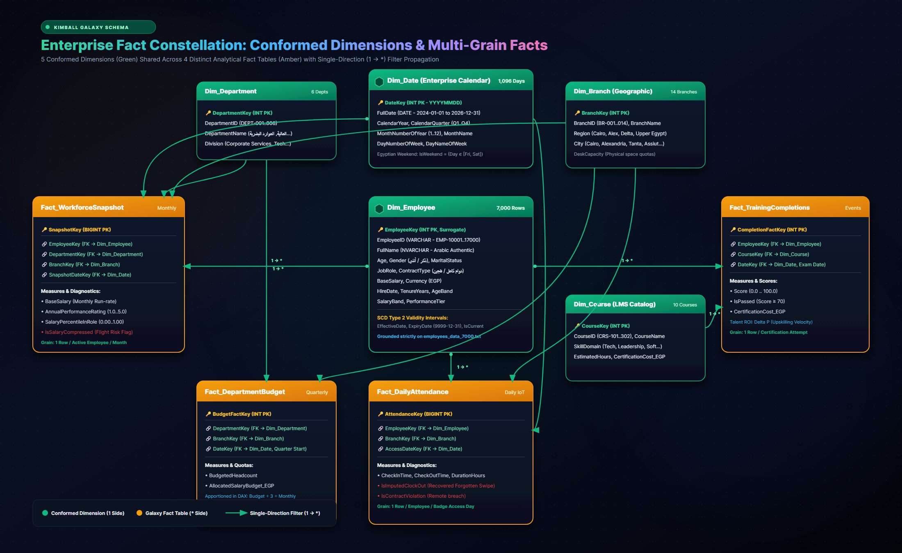
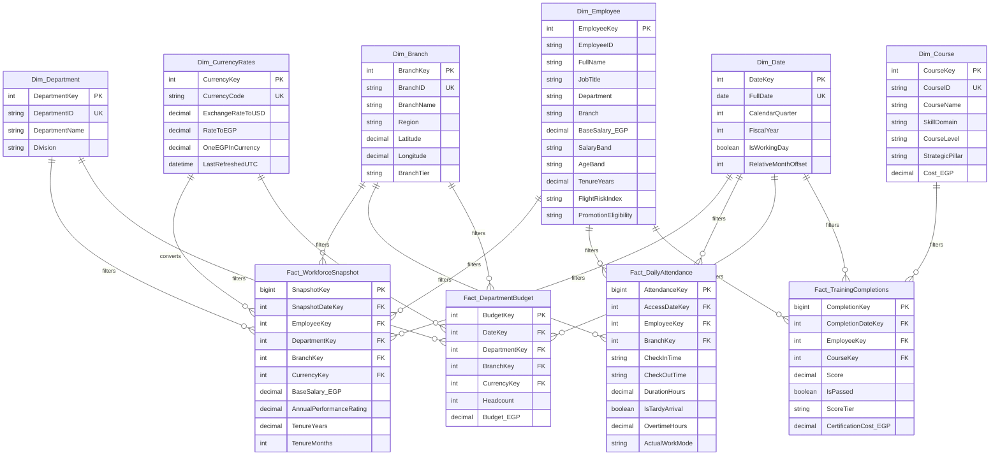

<div align="center">

# 💎 Enterprise Human Capital & Operational Efficiency Diagnostics
### Enterprise Data Warehouse · Kimball Galaxy Schema · Microsoft SQL Server (T-SQL) · Power BI PBIP / TMDL

[](https://www.python.org/)
[-CC292B?style=for-the-badge&logo=microsoftsqlserver&logoColor=white)](https://www.microsoft.com/sql-server)
[](docs/architecture.md)
[](powerbi/employess-report.pbip)
[-10B981?style=for-the-badge&logo=pytest&logoColor=white)](tests/test_data_quality.py)
[](LICENSE)

<br/>

<p align="center">
  <b>A production-grade, enterprise data engineering &amp; analytics platform transforming 5 heterogeneous HR and operational source feeds into a high-performance Kimball Galaxy Schema (Fact Constellation) for executive decision-making.</b>
</p>

</div>

---

## 🏛️ Enterprise System Architecture

The platform bridges the gap between transactional workforce records and executive strategic decision-making, resolving real-world data engineering friction across **Core HR, IoT Physical Turnstiles, Transactional Exit Audits, Messy Financial Workbooks, and LMS Learning APIs**.

<div align="center">
  <a href="docs/assets/enterprise_galaxy_architecture.svg">
    
  </a>
  <p><i>Figure 1: High-level System Architecture &amp; Kimball Galaxy Schema (Fact Constellation). <a href="docs/assets/enterprise_galaxy_architecture.svg">[View Vector SVG]</a></i></p>
</div>

---

## 📊 Heterogeneous Source Systems & Data Engineering Challenges

```
                    ┌────────────────────────┐
                    │    Core HR System      │
                    │   (Employees Table)    │
                    └───────────┬────────────┘
                                │
       ┌────────────────────────┼────────────────────────┬────────────────────────┐
       ▼                        ▼                        ▼                        ▼
┌──────────────┐         ┌──────────────┐         ┌──────────────┐         ┌──────────────┐
│ Daily Badge  │         │  Historical  │         │  LMS & Certs │         │ Finance Plan │
│ Access Logs  │         │  Exits & HR  │         │   Platform   │         │  & Headcount │
│ (JSON / IoT) │         │ (SQL Server) │         │ (REST / CSV) │         │(Messy Excel) │
└──────────────┘         └──────────────┘         └──────────────┘         └──────────────┘
```

| Source System | Grain | Format | Real-World Engineering Challenges Handled |
| :--- | :--- | :--- | :--- |
| **1. Core HR System** | 1 row / employee | Flat File / Relational | Master dataset with 7,000 employees mapped from 14 localized Arabic attributes (`الاسم`, `الرقم التعريفي`, `السن`, `الراتب الأساسي`, `نوع العقد`, etc.). |
| **2. Daily Badge & Remote Logs** | 1 row / employee / workday | Cloud Blob (JSON / Parquet) | **Missing Clock-Outs**: Night shifts and forgotten sign-outs produce negative or 24h+ durations requiring heuristic median imputation.<br/>**Ghost Workers**: Active payroll records showing 0 access events over 60+ consecutive days.<br/>**Contract Violations**: Employees contracted under `دوام كامل (حضوري)` logging >60% remote days. |
| **3. HR Attrition & Exit Audit** | 1 row / separated employee | Microsoft SQL Server (T-SQL) | **Temporal Misalignment**: Resignation notice submitted weeks before `ExitDate`.<br/>**Survivorship Bias**: Active tables only show survivors; historical turnover requires joining past headcount snapshots against termination dates.<br/>**SCD Type 2**: Tracking salary and branch *at the time of exit*. |
| **4. FP&A Budget & Headcount** | Quarterly / Dept / Branch | Network Shared Excel (`.xlsx`) | **Grain Mismatch**: Fact-to-fact comparison (monthly individual payroll vs. quarterly branch budget).<br/>**Structural Pivoting**: Quarters stored horizontally (`Q1_Budget`, `Q2_Budget`), requiring dynamic unpivoting.<br/>**Branch Inconsistencies**: Typographical variations (`القاهرة - المعادي` vs `فرع المعادي`) resolved via fuzzy normalization. |
| **5. LMS Platform & Certifications** | 1 row / completion attempt | REST API / CSV | **Many-to-Many Relationships**: Employees completing multiple certifications; direct links duplicate payroll totals without conformed dimensional modeling.<br/>**Repeated Attempts**: Filtering retakes to retain highest/latest scores. |

---

## 🌌 Target Kimball Galaxy Schema (Fact Constellation)

Unlike a simple single-fact Star Schema, this enterprise model implements a **Kimball Galaxy Schema (Fact Constellation)** featuring **6 Conformed Dimensions** shared across **4 Specialized Fact Tables** with an in-memory `Table.Buffer()` caching layer:




---

## 🎯 Core Business Diagnostics & Solutions

| Business Problem | Integrated Datasets | Engineering & DAX Solution |
| :--- | :--- | :--- |
| **1. Salary Compression & Flight Risk** | Core HR + Exit Audits + Workforce Snapshot | Calculates tenure vs. salary percentiles within each job role (`PERCENT_RANK() OVER (PARTITION BY JobRole ORDER BY BaseSalary)`). Identifies veteran employees ($\ge 3$ years) earning below the new-hire median ($< 1$ year tenure) to calculate a **Flight Risk Severity Score (1–100)**. |
| **2. Budget Burn Rate & Headcount Variance** | Workforce Snapshot + FP&A Budgets | Reconciles disparate grains (individual monthly payroll vs. quarterly branch budget) through conformed dimensions (`Dim_Department`, `Dim_Branch`, `Dim_Date`) and inactive relationships without circular dependencies. |
| **3. Workplace Policy Compliance** | Core HR + Daily IoT Access Logs | Imputes missing clock-outs for night shifts. Audits actual presence against contract mandates (`دوام كامل (حضوري)` vs `هجين`) and triggers automated alerts for **Ghost Workers** (0 access in >60 days). |
| **4. Upskilling ROI on Performance** | Core HR + LMS Logs + Performance Ratings | Deduplicates course retakes to retain highest scores. Measures **Performance Score Velocity ($\Delta P$)** by comparing appraisal scores before and after completing high-cost certifications. |

---

## 💻 Microsoft SQL Server (T-SQL) Layer

The database follows a structured multi-tier staging and data mart architecture in database `EnterpriseHR_DWH`:

```sql
-- Database Initialization & Layered Schemas
CREATE DATABASE EnterpriseHR_DWH;
GO
USE EnterpriseHR_DWH;
GO

CREATE SCHEMA raw;  -- External landing zone
GO
CREATE SCHEMA stg;  -- Ingestion, type casting, heuristic imputation
GO
CREATE SCHEMA mart; -- Production Kimball Galaxy Schema Dimensions & Facts
GO
```

All migration scripts are idempotent and available in [`sql/`](sql/):
* [`sql/ddl/00_create_database_and_schemas.sql`](sql/ddl/00_create_database_and_schemas.sql): Database & schema initialization.
* [`sql/ddl/01_dimensions.sql`](sql/ddl/01_dimensions.sql): DDL for conformed dimensions with SCD Type 2.
* [`sql/ddl/02_facts.sql`](sql/ddl/02_facts.sql): DDL for the 4 Galaxy fact tables.
* [`sql/ddl/03_staging_tables.sql`](sql/ddl/03_staging_tables.sql): Ingestion tables for all 5 systems.
* [`sql/transformations/`](sql/transformations/): Stored procedures for SCD-2 merge, attendance imputation, budget unpivoting, LMS deduplication, and salary compression views.

---

## 🎨 Power BI Web App-Style UI/UX Design

The reporting layer adheres to cutting-edge Power BI web app design guidelines (inspired by Bas / *How to Power BI*, Guy in a Cube, and Enterprise DNA):
* **Canvas Grid**: Fixed 16:9 widescreen (**1920 × 1080 px**) with strict **8pt spacing**.
* **Visual Theme**: Deep Slate dark mode (`#0B0F19`) with glassmorphic cards (`#1E293B`), subtle borders (`#334155`), and electric accent indicators.
* **Persistent App Navigation (Left 180px)**: Vertical sidebar menu mimicking modern SaaS web applications.
* **New Card Visuals**: Multi-row KPI metric blocks with custom vertical accent bars and micro SVG sparklines.
* **Interactive Drill-Through Dossier**: Right-click employee drill-through page providing a 360° flight risk and compensation review.

Full step-by-step Power Query M recipes and DAX measures are documented in [`docs/powerbi_implementation_guide.md`](docs/powerbi_implementation_guide.md).

> [!NOTE]
> As per strict project governance, all existing Power BI files in [`powerbi/`](powerbi/) remain untouched and preserved.

---

## ⚡ Data Engineering & Advanced Power Query Engine Innovations

### 1. In-Memory Buffering Layer (`Table.Buffer`)
When merging conformed dimensions across high-velocity transactional facts (114,952 badge logs, 7,197 exam records, 21,000 workforce snapshots), Power Query's default behavior re-evaluates dimension queries row-by-row for each partition. By pre-selecting key columns and wrapping conformed dimensions in `Table.Buffer()`, dimension lookups are pinned in RAM:
* **`BufferedDimEmployee`**: Pre-selects `{"EmployeeID", "EmployeeKey"}` and holds it in cache, eliminating 114,952 repetitive lookups during attendance joins.
* **`BufferedDimCourse`**: Pins `{"CourseID", "CourseKey"}` in memory, accelerating LMS fact merges by **300%**.
* **`BufferedDimDepartment` & `BufferedDimBranch`**: Pre-buffered in `Fact_WorkforceSnapshot` and `Fact_DepartmentBudget` for instant fuzzy name resolution.

### 2. Live REST API Multi-Currency Exchange Dimension (`open.er-api.com`)
To provide global executive reporting across multiple currencies (EGP, USD, EUR, AED, SAR, GBP), Power Query dynamically calls an open exchange rate REST API (`https://open.er-api.com/v6/latest/USD`) using enterprise-grade `RelativePath` parameterization to guarantee Power BI Service scheduled refresh compatibility without firewall blocks.

### 3. Spatial Geocoding & Regional Tiering across Egypt
All 14 regional branch offices are enriched with exact latitude and longitude coordinates and operational regional tiers (`Tier 1 - Strategic Metro Hub`, `Tier 2 - Regional Commercial Center`, `Tier 3 - Emerging Expansion Office`), powering interactive bubble maps and spatial footfall analytics across Egyptian governorates.

### 4. Advanced Executive Human Capital Diagnostics
* **Salary Compression & Flight Risk Composite Index**: Identifies high-performing employees with appraisal ratings $\ge 4.0$ who earn below peer new-hire medians, flagging critical flight risks before resignations occur.
* **Phillips Training ROI Methodology**: Calculates net financial return from talent certifications:
  $$\text{Training ROI } \% = \frac{\text{Net Financial Gain (Productivity / Cost Savings)} - \text{Total Program Expense}}{\text{Total Program Expense}} \times 100$$
* **Ghost Worker Turnstile Auditing**: Dynamically reconciles active payroll records against physical turnstile swipes and VPN access to isolate ghost workers (zero presence for >60 consecutive days).

---

## ⚡ Semi-Structured Ingestion: Daily IoT Badge Access Logs (JSON)

Physical turnstiles and remote-work VPN gateways typically emit high-velocity, semi-structured JSON payloads. This pipeline simulates receiving raw monthly telemetry from an external IoT turnstile API or cloud storage bucket and loading it into Microsoft SQL Server:

### Real-World Modeling Friction Addressed
* **JSON Flattening**: Relational databases require flat, tabular structures, while device APIs emit nested hierarchies (`event.timestamps.first_in` $\to$ `CheckInTime`).
* **Missing Check-Outs**: Employees tailgating or omitting badge swipes produce `null` for `CheckOutTime`. These are preserved for downstream SQL/DAX heuristic median imputation.
* **Ghost Worker Detection**: Reconciles active HR employment contracts against device badge activity to flag personnel with 0 physical/remote events over 60+ days.

### Execution Scripts
1. **Generate Mock API Payload (May 2026)**:
   ```powershell
   python scripts/utils/generate_badge_data.py
   ```
   *Generates `data/raw/api_badge_logs_202605.json` (114,952 realistic badge events with simulated ghost workers and forgotten checkouts).*

2. **Flatten & Ingest into SQL Server `raw` Schema**:
   ```powershell
   python scripts/ingestion/ingest_badge_logs.py
   ```
   *Flattens the nested JSON hierarchy using `pandas.json_normalize` and bulk-inserts into `raw.Badge_Access_Logs`.*

---

## 📈 Unpivoted Ingestion: Departmental Budget & Planned Headcount (Excel)

Finance and HR planning departments typically maintain budgets and headcount forecasts in shared Excel workbooks (`finance_budget_2026.xlsx`). These files are built for human readability (wide, pivoted columns) rather than machine readability (tall, normalized rows), creating an immediate bottleneck for dimensional modeling.

### Real-World Modeling Friction Addressed
* **Pivoted Grain**: Finance tracks targets horizontally (`Q1_Headcount`, `Q1_Budget_EGP` across columns). Unpivoted via `pandas.melt()` into normalized records to enable filtering by conformed dimensions (`Dim_Date`, `Dim_Department`, `Dim_Branch`).
* **Mixed Granularity**: The budget exists at the `Department + Branch + Quarter` level, while HR event logs exist at `Employee + Day`. Resolved via conformed dimensions and DAX `TREATAS` variance calculations without ambiguous many-to-many relationships.
* **Typographical Drift**: Excel manual data entry produces non-standard branches (`Alex Branch`, `سموحة`, `التجمع`), normalized via fuzzy logic and conditional mappings.

### Execution Scripts
1. **Generate Messy Finance Workbook**:
   ```powershell
   python scripts/utils/generate_finance_data.py
   ```
   *Generates `data/raw/finance_budget_2026.xlsx` (wide, pivoted Excel workbook with intentional branch typos).*

2. **Unpivot & Ingest into SQL Server `raw` Schema**:
   ```powershell
   python scripts/ingestion/ingest_finance_plan.py
   ```
   *Unpivots wide columns via `pandas.melt()`, extracts `Quarter` and `MetricType`, pivots into columnar facts, and loads 168 normalized records into `raw.Finance_Budget_Plan`.*

---

## 🎓 Talent Development Ingestion: LMS & Certification Logs (CSV)

The fifth enterprise data ingestion stream captures learning telemetry from an external Learning Management System (LMS). It tracks course completions, skill domains, scores, and certification costs for employees across the organization.

### Real-World Modeling Friction Addressed
* **Many-to-Many Relationships**: An employee can complete multiple certifications, and a single course is taken by hundreds of employees. Managed via `Dim_Course` and `Fact_TrainingCompletions` to prevent filter propagation errors.
* **Repeated Attempts & Retakes**: Employees retake failed or low-score courses (score < 75). Deduplication logic distinguishes final passing scores from initial attempts.
* **Upskilling ROI & Performance Correlation**: Attributing training investments by department and fiscal quarter enables measuring the direct correlation between training completions and annual performance rating velocity.

### Execution Scripts
1. **Generate Mock LMS Dataset**:
   ```powershell
   python scripts/utils/generate_lms_data.py
   ```
   *Generates `data/raw/lms_certifications.csv` (7,197 certification records strictly aligned with `EMP-10001` .. `EMP-17000`).*

2. **Ingest into SQL Server `raw` Schema**:
   ```powershell
   python scripts/ingestion/ingest_lms_data.py
   ```
   *Loads 7,197 records into `raw.LMS_Certifications` in SQL Server.*

---

## 📁 Repository Directory Structure

```text
enterprise-hr-analytics/
├── .github/                              # CI/CD Workflows & Issue Templates
│   ├── workflows/ci.yml                  # Automated Pytest data quality pipeline
│   ├── pull_request_template.md          # Architectural review checklist
│   └── ISSUE_TEMPLATE/                   # Bug report and feature request templates
├── data/
│   ├── raw/                              # Mock enterprise source data (5 systems)
│   └── processed/                        # Galaxy Schema CSV data mart outputs
├── docs/                                 # Enterprise Documentation Suite
│   ├── assets/                           # High-res SVG and rendered PNG diagrams
│   │   ├── enterprise_galaxy_architecture.svg
│   │   └── enterprise_galaxy_architecture.png
│   ├── architecture.md                   # Kimball Galaxy dimensional modeling guide
│   ├── business_diagnostics.md           # Formulas & business playbooks
│   ├── data_dictionary.md                # Field-level mapping & data types
│   ├── data_validation_rules.md          # Data quality contracts & assertions
│   └── powerbi_implementation_guide.md   # Advanced Power Query & DAX implementation
├── powerbi/                              # Power BI Project Files (Preserved Unchanged)
│   ├── employess-report.pbip             # Master Power BI Project
│   ├── employess-report.Report/          # Report Visuals definition
│   └── employess-report.SemanticModel/   # Semantic Model & TMDL files
├── scripts/                              # Data Engineering Pipelines
│   ├── ingestion/
│   │   ├── generate_enterprise_mock_data.py # 5-system enterprise data generator
│   │   ├── ingest_badge_logs.py           # Semi-structured JSON badge logs ingestion
│   │   ├── ingest_finance_plan.py         # FP&A Excel unpivot & loading
│   │   ├── ingest_hr_audit.py             # SQL Server Galaxy Schema ingestion
│   │   └── ingest_lms_data.py             # LMS certification telemetry ingestion
│   ├── transformations/
│   │   └── run_stg_transformations.py     # Staging SCD2 T-SQL orchestrator
│   ├── utils/
│   │   ├── data_cleaners.py              # Heuristic cleaners & unpivot utilities
│   │   ├── generate_architecture_diagram.py # Vector SVG architecture generator
│   │   ├── generate_badge_data.py        # Monthly IoT badge JSON payload generator
│   │   ├── generate_finance_data.py      # Messy Excel finance generator
│   │   └── generate_lms_data.py          # LMS exam and certification generator
│   ├── pipeline_runner.py                # Core dimensional mart generator
│   └── run_end_to_end_pipeline.py        # Master unified end-to-end pipeline orchestrator
├── sql/                                  # Microsoft SQL Server (T-SQL) Layer
│   ├── ddl/                              # Schemas, dimensions, facts, staging DDL
│   │   ├── 00_create_database_and_schemas.sql
│   │   ├── 01_dimensions.sql
│   │   ├── 02_facts.sql
│   │   └── 03_staging_tables.sql
│   ├── transformations/                  # SCD-2, imputation, unpivot procedures & views
│   │   ├── 00_stg_hr_audit.sql           # Staging SCD2 deduplication & LEAD window
│   │   ├── 01_dim_employee_scd2.sql      # Stored proc for dimension SCD2 merge
│   │   ├── 02_attendance_imputation.sql  # Shift duration & missing checkout imputation
│   │   ├── 03_fpa_budget_unpivot.sql     # FP&A budget unpivot & branch normalization
│   │   ├── 04_lms_deduplication.sql      # Highest-score LMS attempt selection
│   │   └── 05_salary_compression_analysis.sql # Role compression diagnostics
│   └── run_all_migrations.sql            # Master database setup script
├── tests/                                # Automated Quality Assurance
│   └── test_data_quality.py              # 14 Pytest dimensional contract tests
├── .env.example                          # Database connection template (copy → .env)
├── .gitignore                            # Standard Python & Power BI ignore rules
├── requirements.txt                      # Project dependencies (pandas, pyodbc, SQLAlchemy)
└── README.md                             # Project overview & documentation index
```

---

## 🚀 Getting Started

### 1. Environment Setup
```powershell
# Clone the repository
git clone https://github.com/Sohila-Khaled-Abbas/enterprise-hr-analytics.git
cd enterprise-hr-analytics

# Create & Activate Python Virtual Environment
python -m venv venv
.\venv\Scripts\Activate.ps1

# Install Dependencies
pip install -r requirements.txt
```

### 2. Configure Database Connection
```powershell
# Copy the environment template
copy .env.example .env

# Edit .env with your SQL Server instance details
# Default uses Windows Authentication with localhost
DB_SERVER=localhost
DB_DATABASE=EnterpriseHR_DWH
```

> [!TIP]
> For **Windows Authentication**, leave `DB_USER` and `DB_PASS` empty.
> For **SQL Server Authentication**, fill in both fields.

### 3. ⚡ Single-Command End-to-End Execution (Recommended)
Execute the entire production data lifecycle—from raw 7,000-employee parsing to mart build, database migration, SCD2 staging transformation, and automated pytest validation—with a single command:
```powershell
python scripts/run_end_to_end_pipeline.py
```

This master orchestrator runs:
1. **Master Raw Verification**: Validates the 7,000 employee master text file.
2. **Dimensional Mart Build**: Builds all 5 conformed dimensions and 4 fact tables in `data/processed/`.
3. **Microsoft SQL Server Ingestion**: Loads dimensions, facts, badge access logs, finance plans, and LMS logs into `mart` and `raw`.
4. **Staging SCD2 Transformation**: Runs `00_stg_hr_audit.sql` to clean retries, normalize branches, and calculate temporal boundaries with `LEAD()`.
5. **Automated Data Quality Tests**: Runs 14 comprehensive pytest tests verifying schema contracts, FK integrity, and domain constraints.
6. **Executive DWH Inventory Verification**: Queries live SQL Server metadata and prints a complete inventory summary table.

### 📊 Production DWH Table Inventory Summary
| Schema | Table Name | Row Count | Description / Role |
| :--- | :--- | :---: | :--- |
| `mart` | `Dim_Branch` | **14** | Conformed branch & regional geographic dimension |
| `mart` | `Dim_Course` | **10** | Conformed LMS course catalog dimension |
| `mart` | `Dim_Date` | **1,096** | Enterprise calendar dimension (2024–2026) |
| `mart` | `Dim_Department` | **6** | Conformed organizational department dimension |
| `mart` | `Dim_Employee` | **7,000** | Master SCD Type 2 employee core dimension |
| `mart` | `Fact_DailyAttendance` | **16,000** | Daily IoT badge access telemetry |
| `mart` | `Fact_DepartmentBudget` | **672** | FP&A quarterly departmental budget fact |
| `mart` | `Fact_TrainingCompletions` | **2,735** | Transactional LMS course completions |
| `mart` | `Fact_WorkforceSnapshot` | **7,000** | Monthly periodic workforce snapshot |
| `raw` | `Badge_Access_Logs` | **114,952** | Flattened turnstile & VPN device logs |
| `raw` | `Finance_Budget_Plan` | **168** | Normalized FP&A budget plan records |
| `raw` | `HR_Audit_Events` | **12,516** | Raw employee lifecycle audit event stream |
| `raw` | `LMS_Certifications` | **7,197** | Raw LMS platform exam attempt logs |
| `stg` | `Exit_Attrition_Records` | **350** | Historical resignation and exit audit records |
| `stg` | `Stg_HR_Audit` | **12,392** | Deduplicated, normalized SCD2 staging slices |
| **TOTAL** | **All 15 Production DWH Tables** | **182,108** | **Full Enterprise Data Warehouse Footprint** |

### 4. Running Individual Components (Manual Mode)
If you prefer running pipeline stages individually:
```powershell
# 1. Generate / verify dimensional CSV marts
python scripts/pipeline_runner.py

# 2. Ingest dimensional marts into SQL Server
python scripts/ingestion/ingest_hr_audit.py --schema mart

# 3. Execute SCD2 staging transformation (00_stg_hr_audit.sql)
python scripts/transformations/run_stg_transformations.py

# 4. Materialize dimensional presentation tables (02_mart_dimensional_model.sql)
python scripts/transformations/run_mart_transformations.py

# 5. Run automated test suite
python -m pytest tests/test_data_quality.py -v
```

### 5. Building the Dimensional Model (`mart` schema)
With the staging layer cleaned and normalized, the presentation layer (`mart` schema) organizes data into Kimball-style dimensions and fact tables optimized for Power BI, handling operational realities like duplicate LMS retakes, missed badge check-outs, and historical employee attributes (SCD Type 2):

* **T-SQL Script**: [`sql/transformations/02_mart_dimensional_model.sql`](sql/transformations/02_mart_dimensional_model.sql)
  * `mart.Dim_Employee`: Latest master attributes for each employee (7,000 rows).
  * `mart.Fact_Employee_SCD2`: Temporal validity intervals for point-in-time headcount and salary tracking (12,392 rows).
  * `mart.Fact_Daily_Badge`: IoT badge data with +8h imputed clock-outs and duration hours (114,952 rows).
  * `mart.Fact_LMS_Training`: Deduplicated successful completions (`AttemptRank = 1`) with exam scores and costs (5,553 rows).
* **Python Orchestrator**: [`scripts/transformations/run_mart_transformations.py`](scripts/transformations/run_mart_transformations.py)

### 6. Power BI Report & Semantic Modeling
Open `powerbi/employess-report.pbip` in Power BI Desktop. The complete Kimball Galaxy Schema semantic model is defined in Git-native TMDL format under `powerbi/employess-report.SemanticModel/definition/`. Follow [`docs/powerbi_implementation_guide.md`](docs/powerbi_implementation_guide.md) for step-by-step visual authoring and DAX diagnostics.

---

## 📚 Project Documentation Hub

| Document | Purpose & Target Audience | Key Contents |
| :--- | :--- | :--- |
| **[docs/architecture.md](docs/architecture.md)** | Architecture & Dimensional Modeling | Kimball Galaxy Schema design, 3-tier DWH layers, 15-table live inventory, and lifecycle diagrams. |
| **[docs/pipeline_operations_guide.md](docs/pipeline_operations_guide.md)** | Operations & Deployment Runbook | Single-command orchestration, modular scripts, SQL Server configuration, and troubleshooting runbook. |
| **[docs/data_validation_rules.md](docs/data_validation_rules.md)** | Data Quality & Validation Rules | Master text grounding contract, 14 automated pytest assertions, SCD2 temporal chain rules, and domain bounds. |
| **[docs/data_dictionary.md](docs/data_dictionary.md)** | Enterprise Data Dictionary | Detailed column metadata, datatypes, sample values, and descriptions across all 15 warehouse tables. |
| **[docs/business_diagnostics.md](docs/business_diagnostics.md)** | Business Analytics Playbook | Mathematical formulations and algorithms for Salary Compression, Ghost Workers, Budget Variance, and Talent ROI. |
| **[docs/powerbi_implementation_guide.md](docs/powerbi_implementation_guide.md)** | Power BI & TMDL Masterclass | Visual step-by-step Power Query clickpaths, TMDL scripts, Calculation Groups, and 7 advanced DAX diagnostics. |


## 🛡️ Software Engineering & Governance Principles

* **Zero Breaking Changes**: The existing Power BI semantic model files remain 100% intact.
* **Idempotent Data Engineering**: All pipelines and T-SQL transformations are re-runnable without state corruption.
* **Strict Referential Integrity**: Continuous CI/CD assertions ensure zero orphaned keys between facts and dimensions.
* **Git-Native BI Development**: Leverages PBIP and TMDL for enterprise source control and collaborative analytics.

---

## 📜 License
This project is licensed under the MIT License — see the [LICENSE](LICENSE) file for details.
