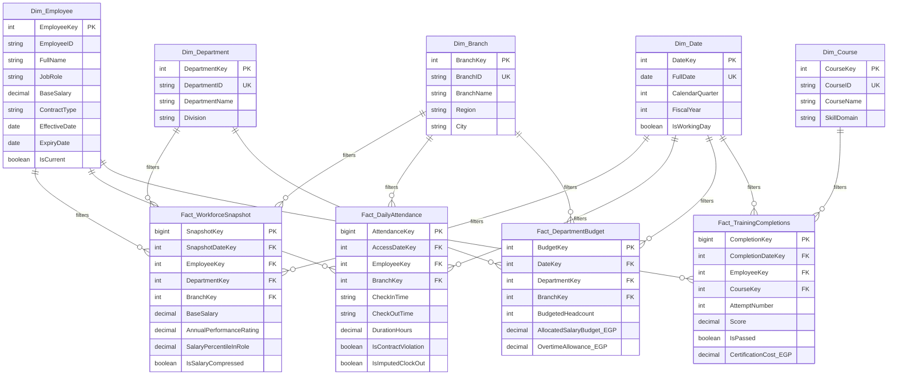

<div align="center">

# 💎 Enterprise Human Capital & Operational Efficiency Diagnostics
### Enterprise Data Warehouse · Kimball Galaxy Schema · Microsoft SQL Server (T-SQL) · Power BI PBIP / TMDL

[](https://www.python.org/)
[-CC292B?style=for-the-badge&logo=microsoftsqlserver&logoColor=white)](https://www.microsoft.com/sql-server)
[](docs/architecture.md)
[](powerbi/employess-report.pbip)
[-10B981?style=for-the-badge&logo=pytest&logoColor=white)](tests/test_data_quality.py)
[](LICENSE)

<br/>

<p align="center">
  <b>A production-grade, enterprise data engineering &amp; analytics platform transforming 5 heterogeneous HR and operational source feeds into a high-performance Kimball Galaxy Schema (Fact Constellation) for executive decision-making.</b>
</p>

</div>

---

## 🏛️ Enterprise System Architecture

The platform bridges the gap between transactional workforce records and executive strategic decision-making, resolving real-world data engineering friction across **Core HR, IoT Physical Turnstiles, Transactional Exit Audits, Messy Financial Workbooks, and LMS Learning APIs**.

<div align="center">
  <a href="docs/assets/enterprise_galaxy_architecture.svg">
    
  </a>
  <p><i>Figure 1: High-level System Architecture &amp; Kimball Galaxy Schema (Fact Constellation). <a href="docs/assets/enterprise_galaxy_architecture.svg">[View Vector SVG]</a></i></p>
</div>

---

## 📊 Heterogeneous Source Systems & Data Engineering Challenges

```
                    ┌────────────────────────┐
                    │    Core HR System      │
                    │   (Employees Table)    │
                    └───────────┬────────────┘
                                │
       ┌────────────────────────┼────────────────────────┬────────────────────────┐
       ▼                        ▼                        ▼                        ▼
┌──────────────┐         ┌──────────────┐         ┌──────────────┐         ┌──────────────┐
│ Daily Badge  │         │  Historical  │         │  LMS & Certs │         │ Finance Plan │
│ Access Logs  │         │  Exits & HR  │         │   Platform   │         │  & Headcount │
│ (JSON / IoT) │         │ (SQL Server) │         │ (REST / CSV) │         │(Messy Excel) │
└──────────────┘         └──────────────┘         └──────────────┘         └──────────────┘
```

| Source System | Grain | Format | Real-World Engineering Challenges Handled |
| :--- | :--- | :--- | :--- |
| **1. Core HR System** | 1 row / employee | Flat File / Relational | Master dataset with 7,000 employees mapped from 14 localized Arabic attributes (`الاسم`, `الرقم التعريفي`, `السن`, `الراتب الأساسي`, `نوع العقد`, etc.). |
| **2. Daily Badge & Remote Logs** | 1 row / employee / workday | Cloud Blob (JSON / Parquet) | **Missing Clock-Outs**: Night shifts and forgotten sign-outs produce negative or 24h+ durations requiring heuristic median imputation.<br/>**Ghost Workers**: Active payroll records showing 0 access events over 60+ consecutive days.<br/>**Contract Violations**: Employees contracted under `دوام كامل (حضوري)` logging >60% remote days. |
| **3. HR Attrition & Exit Audit** | 1 row / separated employee | Microsoft SQL Server (T-SQL) | **Temporal Misalignment**: Resignation notice submitted weeks before `ExitDate`.<br/>**Survivorship Bias**: Active tables only show survivors; historical turnover requires joining past headcount snapshots against termination dates.<br/>**SCD Type 2**: Tracking salary and branch *at the time of exit*. |
| **4. FP&A Budget & Headcount** | Quarterly / Dept / Branch | Network Shared Excel (`.xlsx`) | **Grain Mismatch**: Fact-to-fact comparison (monthly individual payroll vs. quarterly branch budget).<br/>**Structural Pivoting**: Quarters stored horizontally (`Q1_Budget`, `Q2_Budget`), requiring dynamic unpivoting.<br/>**Branch Inconsistencies**: Typographical variations (`القاهرة - المعادي` vs `فرع المعادي`) resolved via fuzzy normalization. |
| **5. LMS Platform & Certifications** | 1 row / completion attempt | REST API / CSV | **Many-to-Many Relationships**: Employees completing multiple certifications; direct links duplicate payroll totals without conformed dimensional modeling.<br/>**Repeated Attempts**: Filtering retakes to retain highest/latest scores. |

---

## 🌌 Target Kimball Galaxy Schema (Fact Constellation)

Unlike a simple single-fact Star Schema, this enterprise model implements a **Kimball Galaxy Schema (Fact Constellation)** featuring **5 Conformed Dimensions** shared across **4 Specialized Fact Tables**:



---

## 🎯 Core Business Diagnostics & Solutions

| Business Problem | Integrated Datasets | Engineering & DAX Solution |
| :--- | :--- | :--- |
| **1. Salary Compression & Flight Risk** | Core HR + Exit Audits + Workforce Snapshot | Calculates tenure vs. salary percentiles within each job role (`PERCENT_RANK() OVER (PARTITION BY JobRole ORDER BY BaseSalary)`). Identifies veteran employees ($\ge 3$ years) earning below the new-hire median ($< 1$ year tenure) to calculate a **Flight Risk Severity Score (1–100)**. |
| **2. Budget Burn Rate & Headcount Variance** | Workforce Snapshot + FP&A Budgets | Reconciles disparate grains (individual monthly payroll vs. quarterly branch budget) through conformed dimensions (`Dim_Department`, `Dim_Branch`, `Dim_Date`) and inactive relationships without circular dependencies. |
| **3. Workplace Policy Compliance** | Core HR + Daily IoT Access Logs | Imputes missing clock-outs for night shifts. Audits actual presence against contract mandates (`دوام كامل (حضوري)` vs `هجين`) and triggers automated alerts for **Ghost Workers** (0 access in >60 days). |
| **4. Upskilling ROI on Performance** | Core HR + LMS Logs + Performance Ratings | Deduplicates course retakes to retain highest scores. Measures **Performance Score Velocity ($\Delta P$)** by comparing appraisal scores before and after completing high-cost certifications. |

---

## 💻 Microsoft SQL Server (T-SQL) Layer

The database follows a structured multi-tier staging and data mart architecture in database `EnterpriseHR_DWH`:

```sql
-- Database Initialization & Layered Schemas
CREATE DATABASE EnterpriseHR_DWH;
GO
USE EnterpriseHR_DWH;
GO

CREATE SCHEMA raw;  -- External landing zone
GO
CREATE SCHEMA stg;  -- Ingestion, type casting, heuristic imputation
GO
CREATE SCHEMA mart; -- Production Kimball Galaxy Schema Dimensions & Facts
GO
```

All migration scripts are idempotent and available in [`sql/`](sql/):
* [`sql/ddl/00_create_database_and_schemas.sql`](sql/ddl/00_create_database_and_schemas.sql): Database & schema initialization.
* [`sql/ddl/01_dimensions.sql`](sql/ddl/01_dimensions.sql): DDL for conformed dimensions with SCD Type 2.
* [`sql/ddl/02_facts.sql`](sql/ddl/02_facts.sql): DDL for the 4 Galaxy fact tables.
* [`sql/ddl/03_staging_tables.sql`](sql/ddl/03_staging_tables.sql): Ingestion tables for all 5 systems.
* [`sql/transformations/`](sql/transformations/): Stored procedures for SCD-2 merge, attendance imputation, budget unpivoting, LMS deduplication, and salary compression views.

---

## 🎨 Power BI Web App-Style UI/UX Design

The reporting layer adheres to cutting-edge Power BI web app design guidelines (inspired by Bas / *How to Power BI*, Guy in a Cube, and Enterprise DNA):
* **Canvas Grid**: Fixed 16:9 widescreen (**1920 × 1080 px**) with strict **8pt spacing**.
* **Visual Theme**: Deep Slate dark mode (`#0B0F19`) with glassmorphic cards (`#1E293B`), subtle borders (`#334155`), and electric accent indicators.
* **Persistent App Navigation (Left 180px)**: Vertical sidebar menu mimicking modern SaaS web applications.
* **New Card Visuals**: Multi-row KPI metric blocks with custom vertical accent bars and micro SVG sparklines.
* **Interactive Drill-Through Dossier**: Right-click employee drill-through page providing a 360° flight risk and compensation review.

Full step-by-step Power Query M recipes and DAX measures are documented in [`docs/powerbi_implementation_guide.md`](docs/powerbi_implementation_guide.md).

> [!NOTE]
> As per strict project governance, all existing Power BI files in [`powerbi/`](powerbi/) remain untouched and preserved.

---

## ⚡ Semi-Structured Ingestion: Daily IoT Badge Access Logs (JSON)

Physical turnstiles and remote-work VPN gateways typically emit high-velocity, semi-structured JSON payloads. This pipeline simulates receiving raw monthly telemetry from an external IoT turnstile API or cloud storage bucket and loading it into Microsoft SQL Server:

### Real-World Modeling Friction Addressed
* **JSON Flattening**: Relational databases require flat, tabular structures, while device APIs emit nested hierarchies (`event.timestamps.first_in` $\to$ `CheckInTime`).
* **Missing Check-Outs**: Employees tailgating or omitting badge swipes produce `null` for `CheckOutTime`. These are preserved for downstream SQL/DAX heuristic median imputation.
* **Ghost Worker Detection**: Reconciles active HR employment contracts against device badge activity to flag personnel with 0 physical/remote events over 60+ days.

### Execution Scripts
1. **Generate Mock API Payload (May 2026)**:
   ```powershell
   python scripts/utils/generate_badge_data.py
   ```
   *Generates `data/raw/api_badge_logs_202605.json` (114,952 realistic badge events with simulated ghost workers and forgotten checkouts).*

2. **Flatten & Ingest into SQL Server `raw` Schema**:
   ```powershell
   python scripts/ingestion/ingest_badge_logs.py
   ```
   *Flattens the nested JSON hierarchy using `pandas.json_normalize` and bulk-inserts into `raw.Badge_Access_Logs`.*

---

## 📈 Unpivoted Ingestion: Departmental Budget & Planned Headcount (Excel)

Finance and HR planning departments typically maintain budgets and headcount forecasts in shared Excel workbooks (`finance_budget_2026.xlsx`). These files are built for human readability (wide, pivoted columns) rather than machine readability (tall, normalized rows), creating an immediate bottleneck for dimensional modeling.

### Real-World Modeling Friction Addressed
* **Pivoted Grain**: Finance tracks targets horizontally (`Q1_Headcount`, `Q1_Budget_EGP` across columns). Unpivoted via `pandas.melt()` into normalized records to enable filtering by conformed dimensions (`Dim_Date`, `Dim_Department`, `Dim_Branch`).
* **Mixed Granularity**: The budget exists at the `Department + Branch + Quarter` level, while HR event logs exist at `Employee + Day`. Resolved via conformed dimensions and DAX `TREATAS` variance calculations without ambiguous many-to-many relationships.
* **Typographical Drift**: Excel manual data entry produces non-standard branches (`Alex Branch`, `سموحة`, `التجمع`), normalized via fuzzy logic and conditional mappings.

### Execution Scripts
1. **Generate Messy Finance Workbook**:
   ```powershell
   python scripts/utils/generate_finance_data.py
   ```
   *Generates `data/raw/finance_budget_2026.xlsx` (wide, pivoted Excel workbook with intentional branch typos).*

2. **Unpivot & Ingest into SQL Server `raw` Schema**:
   ```powershell
   python scripts/ingestion/ingest_finance_plan.py
   ```
   *Unpivots wide columns via `pandas.melt()`, extracts `Quarter` and `MetricType`, pivots into columnar facts, and loads 168 normalized records into `raw.Finance_Budget_Plan`.*

---

## 📁 Repository Directory Structure

```text
enterprise-hr-analytics/
├── .github/                              # CI/CD Workflows & Issue Templates
│   ├── workflows/ci.yml                  # Automated Pytest data quality pipeline
│   ├── pull_request_template.md          # Architectural review checklist
│   └── ISSUE_TEMPLATE/                   # Bug report and feature request templates
├── data/
│   ├── raw/                              # Mock enterprise source data (5 systems)
│   └── processed/                        # Galaxy Schema CSV data mart outputs
├── docs/                                 # Enterprise Documentation Suite
│   ├── assets/                           # High-res SVG and rendered PNG diagrams
│   │   ├── enterprise_galaxy_architecture.svg
│   │   └── enterprise_galaxy_architecture.png
│   ├── architecture.md                   # Kimball Galaxy dimensional modeling guide
│   ├── business_diagnostics.md           # Formulas & business playbooks
│   ├── data_dictionary.md                # Field-level mapping & data types
│   ├── data_validation_rules.md          # Data quality contracts & assertions
│   └── powerbi_implementation_guide.md   # Advanced Power Query & DAX implementation
├── powerbi/                              # Power BI Project Files (Preserved Unchanged)
│   ├── employess-report.pbip             # Master Power BI Project
│   ├── employess-report.Report/          # Report Visuals definition
│   └── employess-report.SemanticModel/   # Semantic Model & TMDL files
├── scripts/                              # Data Engineering Pipelines
│   ├── ingestion/
│   │   ├── generate_enterprise_mock_data.py # 5-system enterprise data generator
│   │   ├── ingest_badge_logs.py           # Semi-structured JSON badge logs ingestion
│   │   └── ingest_hr_audit.py             # SQL Server Galaxy Schema ingestion
│   ├── utils/
│   │   ├── data_cleaners.py              # Heuristic cleaners & unpivot utilities
│   │   └── generate_badge_data.py        # Monthly IoT badge JSON payload generator
│   └── pipeline_runner.py                # End-to-end data processing orchestrator
├── sql/                                  # Microsoft SQL Server (T-SQL) Layer
│   ├── ddl/                              # Schemas, dimensions, facts, staging DDL
│   ├── transformations/                  # SCD-2, imputation, unpivot procedures & views
│   └── run_all_migrations.sql            # Master database setup script
├── tests/                                # Automated Quality Assurance
│   └── test_data_quality.py              # 11 Pytest dimensional contract tests
├── .env.example                          # Database connection template (copy → .env)
├── .gitignore                            # Standard Python & Power BI ignore rules
├── requirements.txt                      # Project dependencies (pandas, pyodbc, SQLAlchemy)
└── README.md                             # Project overview & documentation index
```

---

## 🚀 Getting Started

### 1. Environment Setup
```powershell
# Clone the repository
git clone https://github.com/Sohila-Khaled-Abbas/enterprise-hr-analytics.git
cd enterprise-hr-analytics

# Create & Activate Python Virtual Environment
python -m venv venv
.\venv\Scripts\Activate.ps1

# Install Dependencies
pip install -r requirements.txt
```

### 2. Configure Database Connection
```powershell
# Copy the environment template
copy .env.example .env

# Edit .env with your SQL Server instance details
# Default uses Windows Authentication with localhost\SQLEXPRESS
```

> [!TIP]
> For **Windows Authentication**, leave `DB_USER` and `DB_PASS` empty.
> For **SQL Server Authentication**, fill in both fields.

### 3. Generate Enterprise Source Datasets
Generate realistic test data for all 5 systems (7,000 Core employees, IoT access logs, exit audits, messy Excel budget, LMS attempts):
```powershell
python scripts/ingestion/generate_enterprise_mock_data.py
```

### 4. Ingest Semi-Structured IoT Badge JSON Telemetry
Simulate fetching external IoT device payloads and flattening into SQL Server `raw` schema:
```powershell
# Generate the May 2026 JSON mock API payload (114,952 events)
python scripts/utils/generate_badge_data.py

# Ingest flattened records into raw.Badge_Access_Logs
python scripts/ingestion/ingest_badge_logs.py
```

### 5. Run Galaxy Schema Transformation Pipeline
Transform raw data into the conformed dimensional model in `data/processed/`:
```powershell
python scripts/pipeline_runner.py
```

### 6. Execute Automated Data Quality Tests
Verify primary key uniqueness, foreign key referential integrity, and metric range constraints:
```powershell
pytest -v tests/test_data_quality.py
```

### 7. Deploy SQL Server Migrations
Connect to your Microsoft SQL Server instance (e.g. via SSMS or Azure Data Studio) and run:
```sql
:r sql/ddl/00_create_database_and_schemas.sql
:r sql/ddl/01_dimensions.sql
:r sql/ddl/02_facts.sql
:r sql/ddl/03_staging_tables.sql
```

### 8. Ingest Data into SQL Server
```powershell
# Dry run (validate connection, list files)
python scripts/ingestion/ingest_hr_audit.py --dry-run

# Full ingestion into mart schema
python scripts/ingestion/ingest_hr_audit.py --schema mart

# Truncate and reload
python scripts/ingestion/ingest_hr_audit.py --schema mart --truncate
```

### 9. Open Power BI Report
Open `powerbi/employess-report.pbip` in Power BI Desktop (with Developer Mode / PBIP enabled). Follow [`docs/powerbi_implementation_guide.md`](docs/powerbi_implementation_guide.md) to wire the transformed Galaxy facts and DAX measures.

---

## 🛡️ Software Engineering & Governance Principles

* **Zero Breaking Changes**: The existing Power BI semantic model files remain 100% intact.
* **Idempotent Data Engineering**: All pipelines and T-SQL transformations are re-runnable without state corruption.
* **Strict Referential Integrity**: Continuous CI/CD assertions ensure zero orphaned keys between facts and dimensions.
* **Git-Native BI Development**: Leverages PBIP and TMDL for enterprise source control and collaborative analytics.

---

## 📜 License
This project is licensed under the MIT License — see the [LICENSE](LICENSE) file for details.
