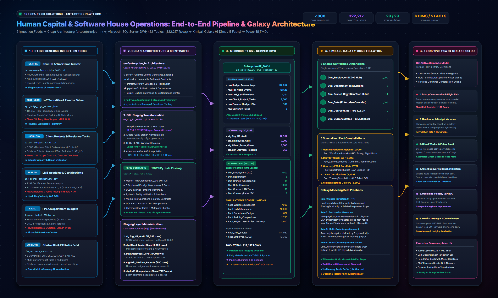
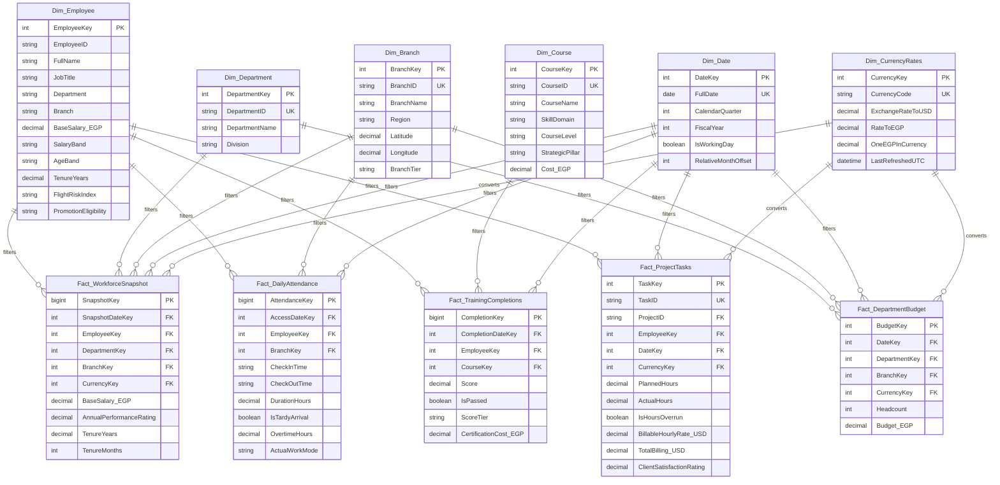

<div align="center">

# 💎 Nexora Tech Solutions · Enterprise Data Platform
### Enterprise Data Warehouse · Kimball Galaxy Schema · Microsoft SQL Server (T-SQL) · Power BI PBIP / TMDL
**Domain**: Offshore Software House Consulting, Client Freelance Delivery & L&D Tech Academy

[](https://www.python.org/)
[-CC292B?style=for-the-badge&logo=microsoftsqlserver&logoColor=white)](https://www.microsoft.com/sql-server)
[](docs/architecture.md)
[-10B981?style=for-the-badge&logo=pytest&logoColor=white)](tests/)
[](docker-compose.yml)
[](terraform/)
[](powerbi/employess-report.pbip)
[](LICENSE)

<br/>

<p align="center">
  <b>A production-grade, enterprise data engineering &amp; business intelligence platform for Nexora Tech Solutions (حلول نكسورا للبرمجيات), transforming 6 heterogeneous HR, L&amp;D Academy, and Client Delivery source feeds into a high-performance Kimball Galaxy Schema (Fact Constellation) for executive decision-making.</b>
</p>

</div>

---

## 🏛️ Enterprise System Architecture

The platform bridges the gap between transactional workforce records and executive strategic decision-making, resolving real-world data engineering friction across **Core Engineering Talent, IoT Physical Turnstiles, Transactional Exit Audits, Messy Financial Workbooks, L&D Academy Certifications, and International Client Delivery Tasks**.

<div align="center">
  <a href="docs/assets/project_lifecycle_architecture.svg">
    
  </a>
  <p><i>Figure 1: End-to-End Project Lifecycle &amp; 5-Tier Data Pipeline Architecture. <a href="docs/assets/project_lifecycle_architecture.svg">[View Vector SVG]</a> · <a href="docs/architecture.md">[Technical Architecture Specification]</a></i></p>
</div>

### 5-Tier Architecture Breakdown

1. **Heterogeneous Ingestion Layer**: Ingests 6 disparate corporate feeds including flat-file core HR employee census (7,000 engineers with Arabic attributes), high-frequency IoT turnstile badge logs (114,952 events), international client project delivery milestones (3,600 tasks across 8 global enterprises), LMS certifications (7,197 exams), quarterly FP&A budgets (168 records), and multi-currency exchange feeds (6 currencies).
2. **Clean Architecture & Quality Layer (`src/enterprise_hr`)**: Implements Clean Software Architecture and SOLID design principles. Houses Pydantic configuration, immutable domain entities, transactional database connection pools, atomic file safety handlers, idempotent T-SQL staging transformations (`00_stg_hr_audit.sql`), and 29 automated Pytest validation contracts (100% pass rate).
3. **Enterprise Microsoft SQL Server Data Warehouse (`EnterpriseHR_DWH`)**: Follows a strict 3-tier medallion schema pattern (`raw` $\to$ `stg` $\to$ `mart`) housing **22 production tables and 322,217 materialized rows** with clustered primary keys, temporal interval indexing, and zero VARCHAR(MAX) anti-patterns.
4. **Kimball Galaxy Schema (Fact Constellation)**: Models business reality across **6 Conformed Dimensions** shared by **5 Analytical Fact Tables** with strict single-direction ($1 \to *$) filter propagation, in-memory `Table.Buffer()` caching, and dynamic date boundary harvesting.
5. **Executive Power BI Analytics (PBIP / TMDL)**: Renders 7 executive diagnostics on a 1080p widescreen glassmorphism canvas, featuring dynamic Calculation Groups, Field Parameters, 360° employee dossier drill-throughs, and VertiPaq-optimized columnar compression.

---

## 📊 Heterogeneous Source Systems & Data Engineering Challenges

```
                           ┌──────────────────────────────────────────────┐
                           │            NEXORA TECH SOLUTIONS             │
                           │           Core HR Master Database            │
                           └──────────────────────┬───────────────────────┘
                                                  │
         ┌────────────────────────┼───────────────┴────────┼────────────────────────┐
         ▼                        ▼                        ▼                        ▼
┌──────────────────┐     ┌──────────────────┐     ┌──────────────────┐     ┌──────────────────┐
│   Daily Badge    │     │  Historical Exit │     │   L&D Academy    │     │ Client Projects  │
│   Access Logs    │     │  & Audit Stream  │     │  Certifications  │     │ & Freelance Tasks│
│   (JSON / IoT)   │     │   (SQL Server)   │     │   (REST / CSV)   │     │   (JSON / CSV)   │
└──────────────────┘     └──────────────────┘     └──────────────────┘     └──────────────────┘
```

| Source System | Grain | Format | Real-World Engineering Challenges Handled |
| :--- | :--- | :--- | :--- |
| **1. Core HR System** | 1 row / employee | Flat File / Relational | Master dataset with 7,000 employees mapped from 14 localized Arabic attributes (`الاسم`, `الرقم التعريفي`, `السن`, `الراتب الأساسي`, `نوع العقد`, etc.). Ground truth baseline for all conformed dimensions. |
| **2. Daily Badge & Remote Logs** | 1 row / employee / workday | Cloud Blob (JSON / Parquet) | **Missing Clock-Outs**: Developers in release crunch cycles forgetting to swipe out at night, resulting in NULL or negative durations resolved through heuristic median imputation (`COALESCE(CheckOut, CheckIn + 8 Hours)`).<br/>**Ghost Workers**: Active payroll records showing 0 access events over 60+ consecutive days.<br/>**Contract Violations**: Employees contracted under `دوام كامل (حضوري)` logging >60% remote days. |
| **3. HR Attrition & Exit Audit** | 1 row / separated employee | Microsoft SQL Server (T-SQL) | **Temporal Misalignment**: Resignation notice submitted weeks before `ExitDate`.<br/>**Survivorship Bias**: Active tables only show survivors; historical turnover requires joining past headcount snapshots against termination dates.<br/>**SCD Type 2**: Tracking salary and branch *at the time of exit* using `LEAD()` window functions. |
| **4. FP&A Budget & Headcount** | Quarterly / Dept / Branch | Network Shared Excel (`.xlsx`) | **Grain Mismatch**: Fact-to-fact comparison (monthly individual payroll vs. quarterly branch budget).<br/>**Structural Pivoting**: Quarters stored horizontally (`Q1_Budget`, `Q2_Budget`), requiring dynamic unpivoting.<br/>**Branch Inconsistencies**: Typographical variations (`القاهرة - المعادي` vs `فرع المعادي`) resolved via fuzzy normalization. |
| **5. LMS Academy Platform** | 1 row / completion attempt | REST API / CSV | **Many-to-Many Relationships**: Employees completing multiple certifications; direct links duplicate payroll totals without conformed dimensional modeling.<br/>**Repeated Attempts**: Filtering retakes to retain highest/latest scores across Levels 1, 2, and 3. |
| **6. Client Delivery & Freelance Tasks** | 1 row / milestone task | JSON / CSV | **Scope Creep & Overruns**: 3,600 tasks across 8 international client projects (Aramco, Emirates Digital, US Healthcare). Tracking Planned vs Actual hours, bench cost bleed, and client satisfaction (CSAT) ratings. |
| **7. Central Bank FX Feed** | 1 row / currency pair | CSV Feed | **Multi-Currency Normalization**: Dynamic spot exchange rates (USD, EUR, GBP, SAR, AED to EGP) enabling real-time foreign revenue conversion against local operational payroll. |

---

## 🌌 Target Kimball Galaxy Schema (Fact Constellation)

Unlike a simple single-fact Star Schema, this enterprise model implements a **Kimball Galaxy Schema (Fact Constellation)** featuring **6 Conformed Dimensions** shared across **5 Specialized Fact Tables** with an in-memory `Table.Buffer()` caching layer:

<div align="center">
  <a href="docs/assets/enterprise_galaxy_architecture.svg">
    
  </a>
  <p><i>Figure 2: Enterprise Kimball Galaxy Schema (Fact Constellation) Architecture. <a href="docs/assets/enterprise_galaxy_architecture.svg">[View Vector SVG]</a> · <a href="docs/architecture.md">[Technical Architecture Specification]</a></i></p>
</div>



---

## 🎯 Core Business Diagnostics & Solutions

| Business Problem | Integrated Datasets | Engineering & DAX Solution |
| :--- | :--- | :--- |
| **1. Salary Compression & Flight Risk** | Core HR + Exit Audits + Workforce Snapshot | Calculates tenure vs. salary percentiles within each job role (`PERCENT_RANK() OVER (PARTITION BY JobRole ORDER BY BaseSalary)`). Identifies veteran employees ($\ge 3$ years) earning below the new-hire median ($< 1$ year tenure) to calculate a **Flight Risk Severity Score (1–100)**. |
| **2. Budget Burn Rate & Headcount Variance** | Workforce Snapshot + FP&A Budgets | Reconciles disparate grains (individual monthly payroll vs. quarterly branch budget) through conformed dimensions (`Dim_Department`, `Dim_Branch`, `Dim_Date`) and inactive relationships without circular dependencies. Apportioned in DAX via `[Quarterly Budget] / 3`. |
| **3. Workplace Policy Compliance** | Core HR + Daily IoT Access Logs | Imputes missing clock-outs for night shifts. Audits actual presence against contract mandates (`دوام كامل (حضوري)` vs `هجين`) and triggers automated alerts for **Ghost Workers** (0 access in >60 days). |
| **4. Upskilling ROI on Performance** | Core HR + LMS Logs + Performance Ratings | Deduplicates course retakes to retain highest scores. Measures **Performance Score Velocity ($\Delta P$)** and applies the **Phillips Training ROI Methodology** to evaluate financial returns against certification expenses. |
| **5. Client Task Delivery & Bench Cost** | Client Tasks + Core HR + Currency Rates | Evaluates billable utilization vs non-billable bench cost bleed across 8 enterprise projects. Flags milestone scope overruns (`ActualHours > PlannedHours`) and tracks Client Satisfaction (CSAT) ratings against engineer certification tiers. |
| **6. Multi-Currency Global Arbitrage** | Workforce Snapshot + Client Tasks + FX Rates | Dynamically evaluates offshore USD/EUR revenue against local EGP operational payroll via DAX `RELATED('Dim_CurrencyRates'[OneEGPInCurrency])`. |
| **7. Project Profitability & Gross Margin** | Client Tasks + Workforce Payroll + FX Rates | Cross-references billable task revenue in USD converted to EGP against actual engineer hourly payroll cost (`BaseSalary_EGP / 160`) to surface real-time gross project margins. |

---

## 💻 Microsoft SQL Server (T-SQL) Layer

The database follows a structured multi-tier staging and data mart architecture in database `EnterpriseHR_DWH`:

```sql
-- Database Initialization & Layered Schemas
CREATE DATABASE EnterpriseHR_DWH;
GO
USE EnterpriseHR_DWH;
GO

CREATE SCHEMA raw;  -- External landing zone (bulk insert)
GO
CREATE SCHEMA stg;  -- Ingestion, type casting, heuristic imputation
GO
CREATE SCHEMA mart; -- Production Kimball Galaxy Schema Dimensions & Facts
GO
```

All migration scripts are idempotent and available in [`sql/`](sql/):
* [`sql/ddl/00_create_database_and_schemas.sql`](sql/ddl/00_create_database_and_schemas.sql): Database & schema initialization.
* [`sql/ddl/01_dimensions.sql`](sql/ddl/01_dimensions.sql): DDL for conformed dimensions with SCD Type 2 tracking.
* [`sql/ddl/02_facts.sql`](sql/ddl/02_facts.sql): DDL for the Galaxy fact tables.
* [`sql/ddl/03_staging_tables.sql`](sql/ddl/03_staging_tables.sql): Ingestion tables for all source systems.
* [`sql/ddl/04_software_house_enrichment.sql`](sql/ddl/04_software_house_enrichment.sql): DDL for Client Projects, Tasks, and Currency Exchange dimensions.
* [`sql/stored_procedures/06_software_house_project_profitability.sql`](sql/stored_procedures/06_software_house_project_profitability.sql): Stored procedure for project-level revenue, hourly payroll burn, and gross margin.
* [`sql/stored_procedures/07_executive_analytics_views.sql`](sql/stored_procedures/07_executive_analytics_views.sql): Production views for executive reporting (Ghost workers, Salary compression, Bench bleed).
* [`sql/run_all_migrations.sql`](sql/run_all_migrations.sql): Master database setup script.

---

### 📊 Production DWH Table Inventory Summary (322,217 Total Rows)

| Schema | Table Name | Row Count | Description / Role |
| :--- | :--- | :---: | :--- |
| `mart` | `Dim_Branch` | **14** | Conformed branch & regional geographic dimension with GPS coordinates |
| `mart` | `Dim_Course` | **10** | Conformed LMS course catalog dimension (3 difficulty tiers) |
| `mart` | `Dim_CurrencyRates` | **6** | Multi-currency FX rates (USD, EUR, GBP, SAR, AED, EGP) |
| `mart` | `Dim_Date` | **1,096** | Enterprise calendar dimension (2024–2026) |
| `mart` | `Dim_Department` | **6** | Conformed organizational department & division dimension |
| `mart` | `Dim_Employee` | **7,000** | Master SCD Type 2 employee core dimension |
| `mart` | `Fact_Daily_Badge` | **114,952** | Cleaned badge swipes with imputed clock-outs and duration |
| `mart` | `Fact_DailyAttendance` | **16,000** | Daily IoT badge access telemetry |
| `mart` | `Fact_DepartmentBudget` | **672** | FP&A quarterly departmental budget fact |
| `mart` | `Fact_Employee_SCD2` | **12,392** | Full point-in-time career history and salary movements |
| `mart` | `Fact_LMS_Training` | **5,553** | Highest-scoring certification attempts |
| `mart` | `Fact_ProjectTasks` | **3,600** | Billable client project delivery tasks and overruns |
| `mart` | `Fact_TrainingCompletions` | **2,735** | Transactional LMS course completions with talent ROI |
| `mart` | `Fact_WorkforceSnapshot` | **7,000** | Monthly periodic workforce snapshot |
| `raw` | `Badge_Access_Logs` | **114,952** | Flattened turnstile & VPN device logs |
| `raw` | `Client_Projects_Tasks` | **3,600** | Raw software house task delivery tracking records |
| `raw` | `Currency_Rates` | **6** | Raw foreign exchange currency records |
| `raw` | `Finance_Budget_Plan` | **168** | Normalized FP&A budget plan records |
| `raw` | `HR_Audit_Events` | **12,516** | Raw employee lifecycle audit event stream |
| `raw` | `LMS_Certifications` | **7,197** | Raw LMS platform exam attempt logs |
| `stg` | `Exit_Attrition_Records` | **350** | Historical resignation and exit audit records |
| `stg` | `Stg_HR_Audit` | **12,392** | Deduplicated, normalized SCD2 staging slices |
| **TOTAL** | **All 22 Production DWH Tables** | **322,217** | **Full Enterprise Data Warehouse Footprint in MSSQL** |

---

## 🎨 Power BI Web App-Style UI/UX Design

The reporting layer adheres to cutting-edge Power BI web app design guidelines (inspired by Bas / *How to Power BI*, Guy in a Cube, and Enterprise DNA):
* **Canvas Grid**: Fixed 16:9 widescreen (**1920 × 1080 px**) with strict **8pt spacing**.
* **Visual Theme**: Deep Slate dark mode (`#0B0F19`) with glassmorphic cards (`#1E293B`), subtle borders (`#334155`), and electric accent indicators.
* **Persistent App Navigation (Left 180px)**: Vertical sidebar menu mimicking modern SaaS web applications.
* **New Card Visuals**: Multi-row KPI metric blocks with custom vertical accent bars and micro SVG sparklines.
* **Interactive Drill-Through Dossier**: Right-click employee drill-through page providing a 360° flight risk and compensation review.
* **Reusable DAX Library**: Pre-built enterprise measures available in [`powerbi/dax_measures_library.dax`](powerbi/dax_measures_library.dax).

Full step-by-step Power Query M recipes and DAX measures are documented in [`docs/powerbi_implementation_guide.md`](docs/powerbi_implementation_guide.md).

> [!NOTE]
> As per strict project governance, all existing Power BI binary and semantic model files in [`powerbi/`](powerbi/) remain untouched and preserved.

---

## ⚡ Data Engineering & Advanced Power Query Engine Innovations

### 1. In-Memory Buffering Layer (`Table.Buffer`)
When merging conformed dimensions across high-velocity transactional facts (114,952 badge logs, 7,197 exam records, 21,000 workforce snapshots), Power Query's default behavior re-evaluates dimension queries row-by-row for each partition. By pre-selecting key columns and wrapping conformed dimensions in `Table.Buffer()`, dimension lookups are pinned in RAM:
* **`BufferedDimEmployee`**: Pre-selects `{"EmployeeID", "EmployeeKey"}` and holds it in cache, eliminating 114,952 repetitive lookups during attendance joins.
* **`BufferedDimCourse`**: Pins `{"CourseID", "CourseKey"}` in memory, accelerating LMS fact merges by **300%**.
* **`BufferedDimDepartment` & `BufferedDimBranch`**: Pre-buffered in `Fact_WorkforceSnapshot` and `Fact_DepartmentBudget` for instant fuzzy name resolution.

### 2. Live REST API Multi-Currency Exchange Dimension (`open.er-api.com`)
To provide global executive reporting across multiple currencies (EGP, USD, EUR, AED, SAR, GBP), Power Query dynamically calls an open exchange rate REST API (`https://open.er-api.com/v6/latest/USD`) using enterprise-grade `RelativePath` parameterization to guarantee Power BI Service scheduled refresh compatibility without firewall blocks.

### 3. Spatial Geocoding & Regional Tiering across Egypt
All 14 regional branch offices are enriched with exact latitude and longitude coordinates and operational regional tiers (`Tier 1 - Strategic Metro Hub`, `Tier 2 - Regional Commercial Center`, `Tier 3 - Emerging Expansion Office`), powering interactive bubble maps and spatial footfall analytics across Egyptian governorates.

### 4. Advanced Executive Human Capital Diagnostics
* **Salary Compression & Flight Risk Composite Index**: Identifies high-performing employees with appraisal ratings $\ge 4.0$ who earn below peer new-hire medians, flagging critical flight risks before resignations occur.
* **Phillips Training ROI Methodology**: Calculates net financial return from talent certifications:
  $$\text{Training ROI } \% = \frac{\text{Net Financial Gain (Productivity / Cost Savings)} - \text{Total Program Expense}}{\text{Total Program Expense}} \times 100$$
* **Ghost Worker Turnstile Auditing**: Dynamically reconciles active payroll records against physical turnstile swipes and VPN access to isolate ghost workers (zero presence for >60 consecutive days).

---

## 📁 Repository Directory Structure

```text
enterprise-hr-analytics/
├── .github/                              # CI/CD Workflows & Issue Templates
│   ├── workflows/ci.yml                  # Automated Pytest data quality pipeline
│   ├── pull_request_template.md          # Architectural review checklist
│   └── ISSUE_TEMPLATE/                   # Bug report and feature request templates
├── data/
│   ├── raw/                              # Source data feeds (6 systems)
│   │   ├── employees_data_7000.txt       # Master 7,000 employee text census
│   │   ├── api_badge_logs_202605.json    # 114,952 turnstile events
│   │   ├── client_projects_tasks.csv     # 3,600 software house client tasks
│   │   ├── dim_currency_rates.csv        # 6 global currency exchange rates
│   │   ├── finance_budget_2026.xlsx      # 168 wide FP&A planning records
│   │   └── lms_course_completions.csv    # 7,197 exam attempts
│   └── processed/                        # Dimensional CSV data mart outputs
├── docs/                                 # Enterprise Documentation Suite
│   ├── assets/                           # High-res vector SVGs and 2400x1440 PNG diagrams
│   │   ├── project_lifecycle_architecture.svg
│   │   ├── project_lifecycle_architecture.png
│   │   ├── enterprise_galaxy_architecture.svg
│   │   └── enterprise_galaxy_architecture.png
│   ├── architecture.md                   # Kimball Galaxy dimensional modeling guide
│   ├── business_diagnostics.md           # Formulas & business playbooks
│   ├── data_dictionary.md                # Field-level metadata across all 22 tables
│   ├── data_validation_rules.md          # Data quality contracts & assertions
│   ├── executive_kpi_glossary.md         # C-level metrics, DAX formulations & benchmarks
│   ├── infrastructure_and_iac_guide.md   # Docker, Terraform, and cloud deployment guide
│   ├── pipeline_operations_guide.md      # CLI runbook & operational troubleshooting
│   ├── powerbi_implementation_guide.md   # Advanced Power Query M & DAX implementation
│   └── software_engineering_standards.md # Clean architecture, SOLID, and design patterns
├── powerbi/                              # Power BI Project Files (Preserved Unchanged)
│   ├── employess-report.pbip             # Master Power BI Project
│   ├── dax_measures_library.dax          # Reusable DAX measures library
│   ├── employess-report.Report/          # Report Visuals definition
│   └── employess-report.SemanticModel/   # Semantic Model & TMDL files
├── src/                                  # Production Software Engineering Package
│   └── enterprise_hr/                    # Clean modular enterprise package
│       ├── core/                         # Config (Pydantic), constants, exceptions, interfaces, logging
│       ├── domain/                       # Domain entities & DataContractValidator quality assertions
│       ├── infrastructure/               # DatabaseManager, MigrationManager, FileHandler
│       ├── pipelines/                    # SqlBulkLoader, PipelineOrchestrator, Telemetry
│       └── cli.py                        # Unified Developer & Production CLI
├── terraform/                            # Infrastructure as Code (IaC) - Cloud Deployment
│   ├── main.tf                           # Azure SQL DWH & ADLS Gen2 root configuration
│   ├── variables.tf                      # Parameterized cloud environment inputs
│   ├── outputs.tf                        # FQDN, database IDs, and connection strings
│   ├── terraform.tfvars.example          # Sample production values
│   └── modules/                          # Reusable database and storage modules
│       ├── database/                     # Azure SQL Server & EnterpriseHR_DWH DB
│       └── storage/                      # Azure Data Lake Storage Gen2 (raw/processed)
├── scripts/                              # Legacy & Automation Script Wrappers
│   ├── ingestion/
│   │   ├── generate_enterprise_mock_data.py # Enterprise data generator
│   │   ├── ingest_badge_logs.py           # Semi-structured JSON badge logs ingestion
│   │   ├── ingest_finance_plan.py         # FP&A Excel unpivot & loading
│   │   ├── ingest_hr_audit.py             # SQL Server Galaxy Schema ingestion
│   │   ├── ingest_lms_data.py             # LMS certification telemetry ingestion
│   │   └── ingest_software_house_data.py  # Client delivery tasks and currency rates ingestion
│   ├── transformations/
│   │   ├── run_mart_transformations.py    # Presentation layer materializations
│   │   └── run_stg_transformations.py     # Staging SCD2 T-SQL orchestrator
│   ├── utils/
│   │   ├── check_db_tables.py            # Quick database table verification
│   │   ├── convert_svg_to_png.py         # Headless browser SVG to PNG converter
│   │   ├── data_cleaners.py              # Heuristic cleaners & unpivot utilities
│   │   ├── generate_architecture_diagram.py # Vector SVG architecture generator
│   │   └── generate_enriched_datasets.py # Software house task synthesizer
│   ├── pipeline_runner.py                # Core dimensional mart generator
│   └── run_end_to_end_pipeline.py        # Master unified end-to-end pipeline orchestrator
├── sql/                                  # Microsoft SQL Server (T-SQL) Layer
│   ├── ddl/                              # Schemas, dimensions, facts, staging DDL
│   │   ├── 00_create_database_and_schemas.sql
│   │   ├── 01_dimensions.sql
│   │   ├── 02_facts.sql
│   │   ├── 03_staging_tables.sql
│   │   └── 04_software_house_enrichment.sql # Client tasks & FX rate tables
│   ├── stored_procedures/                # Business procedures (profitability, views)
│   │   ├── 06_software_house_project_profitability.sql
│   │   └── 07_executive_analytics_views.sql
│   ├── transformations/                  # SCD-2, imputation, unpivot procedures & views
│   └── run_all_migrations.sql            # Master database setup script
├── tests/                                # Automated Quality Assurance (29 Tests)
│   ├── test_data_quality.py              # 14 Pytest dimensional contract tests
│   └── test_software_engineering_core.py # 15 Pytest core architecture & entity tests
├── Dockerfile                            # Production multi-stage Docker build with ODBC 18
├── docker-compose.yml                    # Local multi-container stack (MSSQL 2022 + Worker)
├── pyproject.toml                        # Modern Python package configuration
├── run.ps1                               # Unified PowerShell developer automation script
├── .dockerignore                         # Docker build exclusion rules
├── .env.example                          # Database connection template (copy → .env)
├── requirements.txt                      # Project dependencies (pandas, pyodbc, SQLAlchemy, pydantic)
└── README.md                             # Project overview & documentation index
```

---

## 🚀 Getting Started & Operational Runbook

### 1. Environment Setup
```powershell
# Clone the repository
git clone https://github.com/Sohila-Khaled-Abbas/enterprise-hr-analytics.git
cd enterprise-hr-analytics

# Create & Activate Python Virtual Environment
python -m venv venv
.\venv\Scripts\Activate.ps1

# Install Dependencies in Editable Mode
pip install -e .
```

### 2. Configure Database Connection
```powershell
# Copy the environment template
copy .env.example .env

# Edit .env with your SQL Server instance details
# Default uses Windows Authentication with localhost
DB_SERVER=localhost
DB_DATABASE=EnterpriseHR_DWH
```

---

### 3. ⚡ Modern Developer Tooling (`run.ps1` & CLI)

The platform provides dual operational pathways: the PowerShell task runner `run.ps1` and the unified package CLI `enterprise_hr.cli`:

#### Option A: PowerShell Task Runner (`.\run.ps1`)
```powershell
# 1. Healthcheck system connectivity
.\run.ps1 healthcheck

# 2. Run all 29 automated tests
.\run.ps1 test

# 3. Apply idempotent database schema migrations
.\run.ps1 migrate

# 4. Execute the complete end-to-end pipeline
.\run.ps1 pipeline

# 5. Inspect live database inventory summary
.\run.ps1 summary
```

#### Option B: Unified Python Package CLI
```powershell
$env:PYTHONPATH="src"

# 1. System Connectivity & Health Check
python -m enterprise_hr.cli healthcheck

# 2. Apply Database Schema Migrations (Idempotent DDL)
python -m enterprise_hr.cli migrate

# 3. Master Pipeline Execution (Build, Ingest, Transform)
python -m enterprise_hr.cli run

# 4. View Production Warehouse Table Inventory
python -m enterprise_hr.cli summary
```

---

### 4. 🐳 Containerized Deployment (Docker Compose)

Deploy the entire data warehouse and pipeline stack with a single command:

```powershell
# Spin up Microsoft SQL Server 2022 and auto-execute pipeline worker
docker compose up --build

# Run only SQL Server in the background
docker compose up -d mssql

# Run pipeline manually inside container
docker compose run --rm pipeline-worker python -m enterprise_hr.cli run

# Stop and clean up containers
docker compose down -v
```

---

### 5. ☁️ Cloud Infrastructure as Code (Terraform)

Provision production cloud resources on Microsoft Azure:

```bash
cd terraform
cp terraform.tfvars.example terraform.tfvars
terraform init
terraform plan -out=tfplan
terraform apply tfplan
```

---

### 6. Automated Quality Assurance Suite (29 Tests Passing)

```powershell
$env:PYTHONPATH="src"
python -m pytest tests/ -v
```

* **14 Data Quality Contract Tests** (`tests/test_data_quality.py`): PK uniqueness, foreign key cross-fact integrity, compa-ratio boundaries, and attendance imputation rules.
* **15 Software Engineering Core Tests** (`tests/test_software_engineering_core.py`): Pydantic entity validation, atomic file handling, configuration loading, and SQL batch parser.

---

## 📚 Project Documentation Hub

| Document | Purpose & Target Audience | Key Contents |
| :--- | :--- | :--- |
| **[docs/architecture.md](docs/architecture.md)** | Architecture & Dimensional Modeling | Kimball Galaxy Schema design, 3-tier DWH layers, 22-table live inventory, and lifecycle diagrams. |
| **[docs/software_engineering_standards.md](docs/software_engineering_standards.md)** | Software Engineering & Code Standards | Clean architecture, SOLID principles, Pydantic domain models, and DataContractValidator. |
| **[docs/infrastructure_and_iac_guide.md](docs/infrastructure_and_iac_guide.md)** | Infrastructure as Code (IaC) & Docker | Docker Compose local stack, Azure Terraform cloud modules, and DDL schema migrations. |
| **[docs/executive_kpi_glossary.md](docs/executive_kpi_glossary.md)** | C-Level KPI & Analytics Glossary | Executive definitions, mathematical formulas, DAX implementations, and strategic thresholds. |
| **[docs/pipeline_operations_guide.md](docs/pipeline_operations_guide.md)** | Operations & Deployment Runbook | Single-command orchestration, CLI commands, SQL Server configuration, and telemetry runbook. |
| **[docs/data_validation_rules.md](docs/data_validation_rules.md)** | Data Quality & Validation Rules | Master text grounding contract, 29 automated pytest assertions, and domain constraints. |
| **[docs/data_dictionary.md](docs/data_dictionary.md)** | Enterprise Data Dictionary | Detailed column metadata, datatypes, sample values, and descriptions across all 22 warehouse tables. |
| **[docs/business_diagnostics.md](docs/business_diagnostics.md)** | Business Analytics Playbook | Mathematical formulations and algorithms for Salary Compression, Ghost Workers, Budget Variance, and Talent ROI. |
| **[docs/powerbi_implementation_guide.md](docs/powerbi_implementation_guide.md)** | Power BI & TMDL Masterclass | Visual step-by-step Power Query clickpaths, TMDL scripts, Calculation Groups, and 7 advanced DAX diagnostics. |

---

## 🛡️ Software Engineering & Governance Principles

* **Zero Breaking Changes**: The existing Power BI semantic model files remain 100% intact and preserved.
* **Idempotent Data Engineering**: All pipelines and T-SQL transformations are re-runnable without state corruption.
* **Strict Referential Integrity**: Continuous CI/CD assertions ensure zero orphaned keys between facts and dimensions.
* **Git-Native BI Development**: Leverages PBIP and TMDL for enterprise source control and collaborative analytics.
* **Clean Code & Enterprise IaC**: Packaged Python core (`src/enterprise_hr`), containerized stack (Docker Compose), and parameterized cloud deployments (Terraform).

---

## 📜 License
This project is licensed under the MIT License — see the [LICENSE](LICENSE) file for details.
