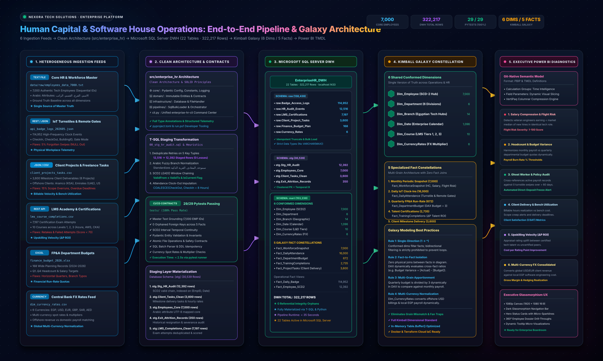

# Enterprise Kimball Galaxy Schema, Software Engineering & IaC Architecture

This document details the architectural design, dimensional modeling principles, software engineering package structure, multi-tier data warehouse layers, and Infrastructure as Code (IaC) implemented in the **Enterprise Human Capital, Software House & Operational Diagnostics Platform**.

---

## 1. High-Level Architecture & Lifecycle

The platform adheres to clean software engineering and enterprise data engineering standards:
- **Heterogeneous Ingestion**: Ingests master HRIS census, IoT badge turnstiles, FP&A Excel budgets, LMS certifications, software house client delivery tasks, and live REST exchange rates.
- **Modular Software Engineering Core (`src/enterprise_hr`)**: Implements SOLID principles, Pydantic domain models, data contract assertions, and connection pooling.
- **Medallion / 3-Tier Kimball Galaxy Warehouse**: Manages Bronze (`raw`), Silver (`stg`), and Gold (`mart`) dimensional schemas in Microsoft SQL Server 2022.
- **Infrastructure as Code (IaC)**: Dual-deployment capability using **Docker Compose** for local reproducibility and **Terraform** for Azure enterprise cloud provisioning.



---

## 2. Kimball Galaxy Schema (Fact Constellation)

In modern enterprise human capital and professional services analytics, operational processes operate at vastly different grains:
1. **Monthly Workforce State**: Periodic snapshot of active personnel, compensation, and annual appraisal scores ($N = 7,000$ rows).
2. **Daily IoT Attendance**: High-frequency clock events, turnstile swipes, and remote work flags ($N = 16,000$ rows).
3. **Quarterly FP&A Budgeting**: Aggregated departmental headcount quotas and salary expenditure limits ($N = 672$ rows).
4. **Talent & Certification Events**: Discrete training completions, exam scores, and educational investment fees ($N = 2,735$ rows).
5. **Software House Project Delivery**: Billable client project tasks, hourly consulting rates, delivery milestones, and overruns ($N = 3,600$ rows).

```
                                  ┌────────────────────────┐
                                  │       Dim_Branch       │
                                  │ (14 Geocoded Governor.)│
                                  └───────────┬────────────┘
                                              │
               ┌──────────────────────────────┼──────────────────────────────┐
               │                              │                              │
               ▼                              ▼                              ▼
     ┌──────────────────┐           ┌──────────────────┐           ┌──────────────────┐
     │  Fact_Workforce  │           │   Fact_Daily     │           │ Fact_Department  │
     │     Snapshot     │           │   Attendance     │           │     Budget       │
     └─────────┬────────┘           └────────┬─────────┘           └────────┬─────────┘
               │                             │                              │
               ├─────────────────────────────┼──────────────────────────────┤
               │                             │                              │
               ▼                             ▼                              │
     ┌──────────────────┐           ┌──────────────────┐                    │
     │   Dim_Employee   │           │     Dim_Date     │◄───────────────────┘
     │ (7,000 Conformed)│           │  (2024 - 2026)   │
     └─────────┬────────┘           └────────┬─────────┘
               │                             │
               ├─────────────────────────────┼──────────────────────────────┐
               │                             │                              │
               ▼                             ▼                              ▼
     ┌──────────────────┐           ┌──────────────────┐           ┌──────────────────┐
     │Fact_ProjectTasks │           │Fact_TrainingComp │           │Dim_CurrencyRates │
     │ (3,600 Delivery) │           │(2,735 Completions│           │  (6 Active FX)   │
     └─────────┬────────┘           └────────┬─────────┘           └────────┬─────────┘
               │                             │                              │
               │                             ▼                              │
               │                    ┌──────────────────┐                    │
               │                    │    Dim_Course    │                    │
               │                    │ (10 Enterprise)  │                    │
               │                    └──────────────────┘                    │
               └────────────────────────────────────────────────────────────┘
```

---

## 3. The 3-Tier Enterprise Warehouse Architecture

```
┌────────────────────────────────────────────────────────────────────────────┐
│ 1. RAW BRONZE LANDING LAYER (Schema: raw / External REST APIs)             │
├────────────────────────────────────────────────────────────────────────────┤
│ • raw.Badge_Access_Logs (114,952 rows) - Physical & virtual IoT clock-ins  │
│ • raw.HR_Audit_Events (12,516 rows) - System transaction change logs       │
│ • raw.LMS_Certifications (7,197 rows) - Raw exam completions & attempts   │
│ • raw.Client_Projects_Tasks (3,600 rows) - Software house consulting tasks │
│ • raw.Finance_Budget_Plan (168 rows) - Wide departmental budget plans      │
│ • raw.Currency_Rates (6 rows) - Currency exchange rates                    │
│ • Live REST API: open.er-api.com/v6/latest/USD                             │
└─────────────────────────────────────┬──────────────────────────────────────┘
                                      │
                                      ▼
┌────────────────────────────────────────────────────────────────────────────┐
│ 2. STAGING SILVER & AUDIT LAYER (Schema: stg / dbo Migrations)             │
├────────────────────────────────────────────────────────────────────────────┤
│ • stg.Stg_HR_Audit (12,392 rows) - Deduplicated SCD2 audit chain           │
│ • stg.Exit_Attrition_Records (350 rows) - Voluntary/involuntary exits      │
│ • stg.Pipeline_Execution_Audit - Pipeline telemetry and execution logging │
│ • dbo._schema_migrations - Versioned DDL tracking catalog                  │
└─────────────────────────────────────┬──────────────────────────────────────┘
                                      │
                                      ▼
┌────────────────────────────────────────────────────────────────────────────┐
│ 3. ANALYTICAL GOLD MART LAYER (Schema: mart / Power BI VertiPaq Model)     │
├────────────────────────────────────────────────────────────────────────────┤
│ Conformed Dimensions:                                                      │
│   • mart.Dim_Employee (7,000 rows) - SCD Type 2 active master census       │
│   • mart.Dim_Department (6 rows) - Corporate departments & divisions       │
│   • mart.Dim_Branch (14 rows) - Geocoded regional offices with GPS coord.   │
│   • mart.Dim_Date (1,096 rows) - Enterprise calendar (2024 - 2026)         │
│   • mart.Dim_Course (10 rows) - Professional skill development catalog     │
│   • mart.Dim_CurrencyRates (6 rows) - Multi-currency rates (EGP/USD/EUR/..)│
│                                                                            │
│ Galaxy Fact Tables:                                                        │
│   • mart.Fact_WorkforceSnapshot (7,000 rows) - Monthly compensation state  │
│   • mart.Fact_DailyAttendance (16,000 rows) - Daily badge compliance       │
│   • mart.Fact_DepartmentBudget (672 rows) - Unpivoted quarterly FP&A plan  │
│   • mart.Fact_TrainingCompletions (2,735 rows) - Talent ROI & certifications│
│   • mart.Fact_ProjectTasks (3,600 rows) - Billable client delivery & tasks │
│                                                                            │
│ Derived Point-in-Time & Aggregated Marts:                                  │
│   • mart.Fact_Daily_Badge (114,952 rows)                                   │
│   • mart.Fact_Employee_SCD2 (12,392 rows)                                  │
│   • mart.Fact_LMS_Training (5,553 rows)                                    │
└────────────────────────────────────────────────────────────────────────────┘
```

### Live Database Production Inventory (22 Tables, 322,217 Total Rows)

| Schema | Table Name | Row Count | Primary Key / Cluster Key | Business Domain |
| :--- | :--- | :--- | :--- | :--- |
| `mart` | `Dim_Branch` | 14 | `BranchKey` | Geocoded branch offices across Egypt with GPS coordinates. |
| `mart` | `Dim_Course` | 10 | `CourseKey` | Professional development and technical skills catalog. |
| `mart` | `Dim_CurrencyRates` | 6 | `CurrencyKey` | Foreign exchange rates for international freelancing/contracts. |
| `mart` | `Dim_Date` | 1,096 | `DateKey` (`YYYYMMDD`) | Conformed 3-year standard business calendar. |
| `mart` | `Dim_Department` | 6 | `DepartmentKey` | Corporate departments, divisions, and cost centers. |
| `mart` | `Dim_Employee` | 7,000 | `EmployeeKey` / `EmployeeID` | Conformed master census strictly grounded on 7,000 records. |
| `mart` | `Fact_Daily_Badge` | 114,952 | `LogID` | Cleaned badge swipes with imputed clock-outs and duration. |
| `mart` | `Fact_DailyAttendance` | 16,000 | `AttendanceKey` | Synthesized daily attendance, shifts, and remote flags. |
| `mart` | `Fact_DepartmentBudget` | 672 | `BudgetKey` | Unpivoted quarterly OPEX budget and headcount targets. |
| `mart` | `Fact_Employee_SCD2` | 12,392 | `StagingKey` | Full point-in-time career history and salary movements. |
| `mart` | `Fact_LMS_Training` | 5,553 | `(EmployeeID, CourseID)` | Highest-scoring certification attempts. |
| `mart` | `Fact_ProjectTasks` | 3,600 | `TaskKey` (Identity) | Billable software house client tasks, hours, and overruns. |
| `mart` | `Fact_TrainingCompletions` | 2,735 | `CompletionKey` | Deduplicated training completions with talent ROI. |
| `mart` | `Fact_WorkforceSnapshot` | 7,000 | `SnapshotKey` | Periodic workforce compensation, compa-ratio, and flight risk. |
| `raw` | `Badge_Access_Logs` | 114,952 | `LogID` | Raw IoT badge turnstile and VPN event logs. |
| `raw` | `Client_Projects_Tasks` | 3,600 | `RawTaskID` (Identity) | Raw software house task delivery tracking records. |
| `raw` | `Currency_Rates` | 6 | `RawCurrencyID` (Identity) | Raw FX currency exchange rate entries. |
| `raw` | `Finance_Budget_Plan` | 168 | `PlanID` | Raw wide departmental FP&A worksheets. |
| `raw` | `HR_Audit_Events` | 12,516 | `(EmployeeID, EffectiveDate)` | Raw HRIS transactional event logs. |
| `raw` | `LMS_Certifications` | 7,197 | `AttemptID` | Raw LMS exam attempt logs. |
| `stg` | `Exit_Attrition_Records` | 350 | `ExitAuditID` | Resignation, retirement, and termination audits. |
| `stg` | `Stg_HR_Audit` | 12,392 | `StagingKey` | Staged SCD2 audit chain with LEAD() valid-to ranges. |
| **TOTAL** | **All 22 Tables** | **322,217** | — | **Fully live and populated in Microsoft SQL Server** |

---

## 4. Reusable Software Engineering Architecture (`src/enterprise_hr`)

The platform codebase is structured into modular layers adhering to SOLID design:
```
src/enterprise_hr/
├── core/                         # Config, constants, exceptions, interfaces, logging
├── domain/                       # Pydantic entity models and DataContractValidator
├── infrastructure/               # DatabaseManager, MigrationManager, FileHandler
├── pipelines/                    # SqlBulkLoader, PipelineOrchestrator, Telemetry
└── cli.py                        # Unified CLI (healthcheck, migrate, run, summary)
```

---

## 5. Infrastructure as Code (IaC) & Deployment

The data platform includes complete Infrastructure as Code automation:
1. **Docker & Docker Compose (`Dockerfile`, `docker-compose.yml`)**:
   - Runs Microsoft SQL Server 2022 in a containerized environment with healthchecks.
   - Runs the pipeline worker with Microsoft ODBC Driver 18, automated schema migrations, and ingestion.
2. **Terraform (`terraform/`)**:
   - Modular HCL code provisioning Azure SQL Server, `EnterpriseHR_DWH` database, and Azure Data Lake Storage Gen2 (ADLS Gen2) with raw and processed storage containers.
3. **Database Schema Migrations (`MigrationManager`)**:
   - Idempotent DDL migrations tracking executed scripts in `dbo._schema_migrations`.
