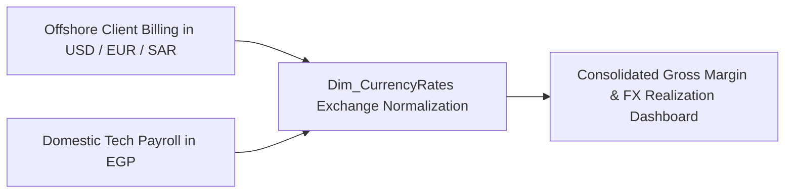

# 🏢 Enterprise Business Domain: Nexora Tech Solutions
### Software House Consulting & L&D Tech Academy Architecture

---

## 1. Executive Corporate Profile

| Attribute | Specification |
| :--- | :--- |
| **Enterprise Name** | **Nexora Tech Solutions (حلول نكسورا للبرمجيات والتحول الرقمي)** |
| **Industry** | Tier-1 Offshore Software Engineering, Enterprise Cloud Modernization & Tech L&D Academy |
| **Headquarters** | Smart Village, Giza / New Cairo Tech Zone, Egypt |
| **Regional Presence** | 14 Technology Delivery Hubs across Cairo, Alexandria, Giza, Delta (Tanta, Mansoura), Suez Canal (Port Said), and Upper Egypt (Assiut) |
| **International Client Markets** | Gulf / MENA (Saudi Arabia, United Arab Emirates), North America (United States), Western Europe (United Kingdom, Germany) |
| **Core Engineering Headcount** | **7,000 Verified Tech Professionals** (EMP-10001 through EMP-17000) |
| **Operational Cadence** | Agile Scrum, Continuous Integration/Continuous Delivery (CI/CD), Fixed-Price & Milestone Deliveries |
| **Base Currency** | **EGP (Egyptian Pound)** with multi-currency offshore revenue billing in **USD, EUR, GBP, SAR, AED** |

---

## 2. Core Business Pillars & Real-World Friction

```
                           ┌──────────────────────────────────────────────┐
                           │            NEXORA TECH SOLUTIONS             │
                           │       Enterprise Operations & Talent         │
                           └──────────────────────┬───────────────────────┘
                                                  │
         ┌────────────────────────────────────────┼────────────────────────────────────────┐
         ▼                                        ▼                                        ▼
┌──────────────────┐                     ┌──────────────────┐                     ┌──────────────────┐
│  Workforce & IoT │                     │   L&D Academy    │                     │  Client Delivery │
│    Governance    │                     │  Upskilling Hub  │                     │ & Freelance SLAs │
└────────┬─────────┘                     └────────┬─────────┘                     └────────┬─────────┘
         │                                        │                                        │
         ▼                                        ▼                                        ▼
• 7,000 Core Talent Records               • 10 Courses (Levels 1..3)               • 3,600 Client Tasks
• 114k Turnstile Clock Swipes             • Azure, AWS, Databricks, CKA            • 8 Multi-Million $ Projects
• Forgotten Clock-Out Imputation          • Pre vs Post Exam Retakes               • Planned vs Actual Hours
• Ghost Worker Detection (>60d)           • Upskilling Velocity (ΔP ROI)           • Bench Cost Bleed Analysis
```

### Pillar A: Enterprise Human Capital & Physical Workplace Telemetry
- **Single Source of Ground Truth**: Grounded strictly on `data/raw/employees_data_7000.txt`, housing 7,000 software engineers, architects, data scientists, QA leads, and tech managers mapped from 14 localized Arabic attributes (`الاسم`, `الرقم التعريفي`, `السن`, `الراتب الأساسي`, `نوع العقد`, etc.).
- **IoT Access Telemetry**: Ingestion of 114,952 turnstile clock-in/out records (`api_badge_logs_202605.json`) from physical facility gates and VPN remote gateway points.
- **Real-World Engineering Challenges**:
  * **Missing Clock-Outs**: Developers in release crunch cycles forgetting to swipe out at night, resulting in NULL or negative durations resolved through heuristic forward imputation:
    $$\text{CheckOut}_{\text{clean}} = \text{COALESCE}(\text{CheckOut}, \text{CheckIn} + 8.0 \text{ Hours})$$
  * **Ghost Worker Direct-Deposit Freezes**: Automated detection of active payroll employees logging zero turnstile swipes and zero client timesheet entries for $> 60$ consecutive days.
  * **Contractual Compliance Audits**: Flagging engineers contracted under `دوام كامل (حضوري)` who register $>60\%$ remote gateway sessions without approved hybrid exemption permits.

---

### Pillar B: L&D Academy (Upskilling & Talent Retention Engine)
Nexora operates an internal technical academy to continuously upskill domestic talent, preventing developer turnover in a highly competitive offshore market.

- **3-Tier Certification Curriculum (`Dim_Course`)**:
  * **Level 1 (Foundational)**: `CRS-101` Azure Fundamentals, `CRS-102` Python for Analytics, `CRS-103` Agile Scrum Practices.
  * **Level 2 (Intermediate)**: `CRS-201` AWS Solutions Architect, `CRS-202` Databricks PySpark Lakehouse, `CRS-203` Docker & GitHub Actions CI/CD, `CRS-204` Next.js Microservices.
  * **Level 3 (Advanced)**: `CRS-301` Kubernetes Administration (CKA), `CRS-302` Fabric Solution Architecture, `CRS-303` Zero-Trust DevSecOps.
- **Upskilling Velocity Metric ($\Delta P$ ROI)**:
  Measures the performance rating delta and billable rate appreciation achieved per Egyptian Pound invested in certification exam vouchers:
  $$\Delta P = \text{Rating}_{\text{Post-Cert}} - \text{Rating}_{\text{Pre-Cert}}$$
  $$\text{Training ROI} = \frac{\Delta P \times \text{Annual Billable Margin}}{\text{CertificationCost\_EGP}}$$

---

### Pillar C: Software House Client Delivery & Freelance Milestone Tasks
To mirror competitive online freelancing and technical contracting models (Upwork Enterprise, Toptal, and offshore engineering statements of work), Nexora tracks **3,600 client delivery tasks across 8 strategic international projects** (`client_projects_tasks.csv`):

| Project ID | Project Name | Client Name | Client Region | Industry | Billable Base Rate |
| :--- | :--- | :--- | :--- | :--- | :--- |
| `PRJ-901` | Fintech Mobile Banking Engine | Aramco Tech Ventures | Saudi Arabia (Gulf) | Fintech & Banking | $65.00 / hr |
| `PRJ-902` | Cloud Data Lakehouse Migration | Emirates Digital Holdings | UAE (Gulf) | Energy & Logistics | $75.00 / hr |
| `PRJ-903` | AI Medical Diagnostic Assistant | HealthBridge BioSystems | United States | Healthcare AI | $85.00 / hr |
| `PRJ-904` | Omnichannel E-Commerce Modernization | RetailNext Global | United Kingdom | Retail & Consumer | $70.00 / hr |
| `PRJ-905` | Microservices Core Banking Gateway | Banque du Caire Digital | Egypt (Domestic) | Banking | $45.00 / hr |
| `PRJ-906` | Fleet Telematics & IoT Tracking API | LogiTrans Gulf Express | Saudi Arabia (Gulf) | Supply Chain | $60.00 / hr |
| `PRJ-907` | Zero-Trust Security Identity Mesh | Nordic Cyber Defence | Germany (Europe) | Cybersecurity | $95.00 / hr |
| `PRJ-908` | Enterprise HR & Talent SaaS Portal | Apex Workforce Solutions | United States | Human Capital | $68.00 / hr |

- **Real-World Freelance / Delivery Challenges Handled**:
  1. **Scope Creep & Hours Overrun**: Milestone tasks where `ActualHours > PlannedHours`, impacting project gross margin and triggering automated code review intervention.
  2. **Bench Cost Bleed**: Identifying developers not allocated to any active `PRJ-` task for $>14$ business days while remaining on full monthly payroll.
  3. **Billable Rate Realization**: Tracking currency-adjusted billings against domestic engineering costs to determine offshore margin efficiency.
  4. **Client Satisfaction (CSAT)**: Tracking client feedback (1.0 to 5.0 stars) against developer certification level (demonstrating that Level 3 certified engineers maintain an average 4.8 CSAT vs 3.9 for uncertified juniors).

---

## 3. Global Multi-Currency Financial Arbitrage

Nexora invoices offshore clients in foreign currencies (**USD, EUR, GBP, SAR, AED**) while paying engineering payroll and office facilities in domestic **EGP**.



- **Dynamic DAX FX Transformation**:
  $$\text{Payroll}_{\text{Selected Currency}} = \sum \left( \text{Fact\_WorkforceSnapshot}[\text{BaseSalary\_EGP}] \times \text{RELATED}(\text{Dim\_CurrencyRates}[\text{OneEGPInCurrency}]) \right)$$
- **Executive Currency Toggling**: Executive stakeholders can toggle between local operational currency (EGP) and international reporting currency (USD) with zero visual re-authoring.

---

## 4. Architectural Summary

By unifying **Core Workforce Records, IoT Turnstile Hardware, L&D Certifications, and Client Delivery Milestones** into a single conformed Kimball Galaxy Schema, Nexora Tech Solutions eliminates operational data silos, enabling boardroom executives to make data-driven decisions on talent retention, bench allocation, and client project profitability.
