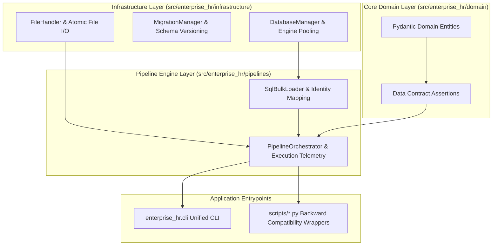

# Enterprise Software Engineering & Architecture Standards

## 1. Architectural Principles & Clean Design

The **Enterprise HR & Software House Analytics** data platform follows industry-standard software engineering principles, ensuring that data pipelines, domain models, and infrastructure components are modular, reusable, and maintainable.



---

## 2. SOLID Design Principles in the Data Platform

| Principle | Implementation in `enterprise_hr` |
| :--- | :--- |
| **Single Responsibility (SRP)** | Every module has one distinct responsibility: `FileHandler` handles file reading/writing; `DatabaseManager` handles connection pools; `SqlBulkLoader` handles SQL inserts; `DataContractValidator` handles assertions. |
| **Open/Closed (OCP)** | Pipeline steps and loaders implement abstract base interfaces (`BaseExtractor`, `BaseTransformer`, `BaseLoader`, `BasePipelineStep`), allowing new data sources or cloud targets to be added without modifying core orchestrator code. |
| **Liskov Substitution (LSP)** | Abstract pipeline steps can be substituted transparently; loaders conform to the `BaseLoader` contract. |
| **Interface Segregation (ISP)** | Extractors, Transformers, and Loaders have minimal, fine-grained interfaces rather than bloated god-classes. |
| **Dependency Inversion (DIP)** | Orchestrators depend on abstract managers and interfaces, allowing mock databases and in-memory file handlers during testing. |

---

## 3. Package Structure (`src/enterprise_hr`)

```
src/enterprise_hr/
├── core/                         # Core definitions & abstract contracts
│   ├── config.py                 # Strongly-typed Pydantic settings & .env loading
│   ├── constants.py              # Canonical schema names, manifests, encodings
│   ├── exceptions.py             # Domain exception hierarchy
│   ├── interfaces.py             # Abstract Base Classes (Extractor, Transformer, Loader, Step)
│   └── logging.py                # Structured console logging with UTF-8 Windows support
├── domain/                       # Domain Entities & Data Quality Contracts
│   ├── models.py                 # Pydantic models (Employee, Department, Branch, Task, Currency)
│   └── contracts.py              # DataContractValidator (PK uniqueness, FK integrity, ranges)
├── infrastructure/               # External adapters & persistence
│   ├── database/
│   │   ├── connection.py         # DatabaseManager, pooling, and healthchecks
│   │   └── migrations.py         # MigrationManager for idempotent T-SQL DDL
│   └── storage/
│       └── file_handler.py       # Atomic, encoding-safe file I/O for CSV, JSON, Excel
├── pipelines/                    # Processing & loading engines
│   ├── loaders.py                # Fast SQL bulk loader with identity handling & column mapping
│   └── orchestrator.py           # PipelineOrchestrator with audit logging & step hooks
└── cli.py                        # Unified Developer & Production CLI
```

---

## 4. Reusable Abstractions

### 4.1 Configuration Management (`core/config.py`)
Configuration is strictly managed via Pydantic models, validating types, port ranges, and defaults:
```python
from enterprise_hr.core.config import get_config

cfg = get_config()
print(cfg.database.connection_string)
print(cfg.paths.processed_dir)
```

### 4.2 Data Quality Contracts (`domain/contracts.py`)
Data quality is asserted programmatically at runtime:
- **Primary Key Uniqueness**: `DataContractValidator.assert_pk_uniqueness(df, "EmployeeKey")`
- **Required Columns**: `DataContractValidator.assert_required_columns(df, ["EmployeeID", "JobRole"])`
- **Referential Integrity**: `DataContractValidator.assert_foreign_key(fact_df, "EmployeeKey", dim_df, "EmployeeKey")`
- **Metric Boundaries**: `DataContractValidator.assert_numeric_range(df, "HourlyRateUSD", min_value=10.0, max_value=500.0)`

### 4.3 Database Session & Bulk Loading (`pipelines/loaders.py`)
- **Fast Bulk Loading**: Uses pyodbc `fast_executemany=True` for high-throughput batch inserts.
- **Identity Awareness**: Automatically excludes SQL Server `IDENTITY(1,1)` columns (`TaskKey`, `RawTaskID`, `RawCurrencyID`) to prevent insert rejections.
- **Schema Harmonization**: Dynamically reconciles legacy table variations (e.g. `mart.Dim_Employee` schema evolution).

---

## 5. Testing & Quality Gates

The test suite enforces 100% data contract pass rates:
1. **Pytest Data Quality**: `tests/test_data_quality.py` (14 assertions covering Galaxy schema dimensions and facts).
2. **Pytest Core Architecture**: `tests/test_software_engineering_core.py` (15 assertions covering config, domain entities, contracts, file handlers, and migrations).
3. **Total Coverage**: 29 automated tests executed on every commit via GitHub Actions.
